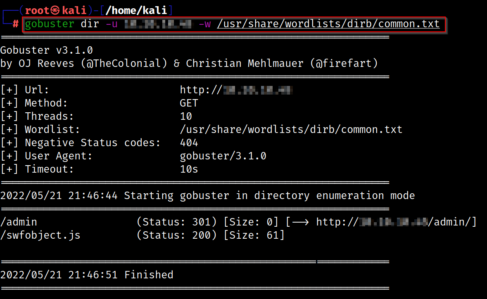
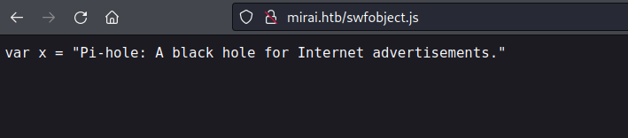
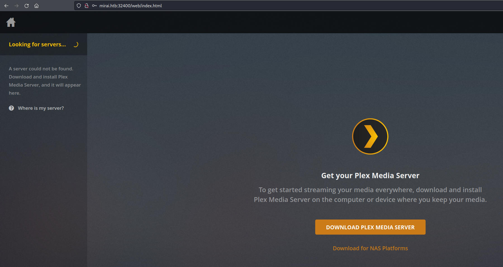
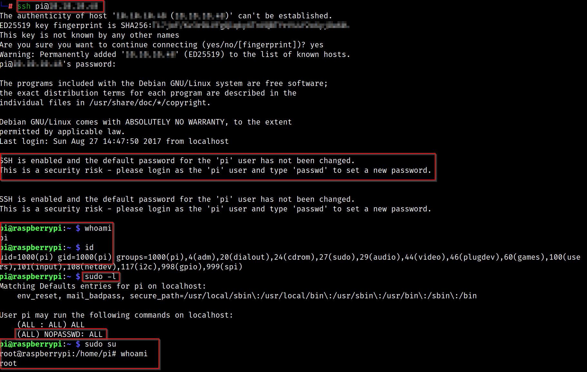
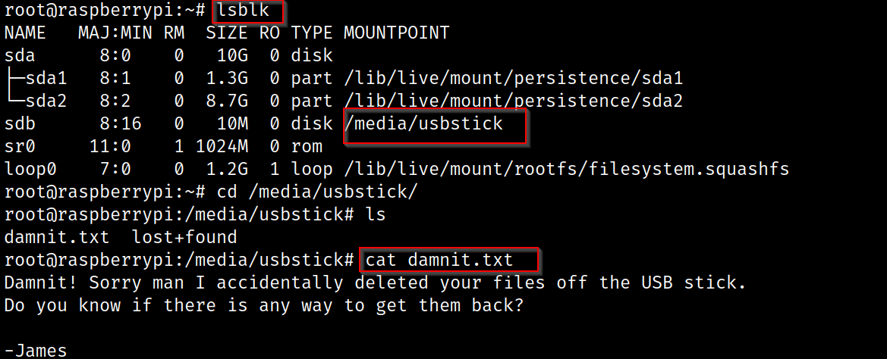
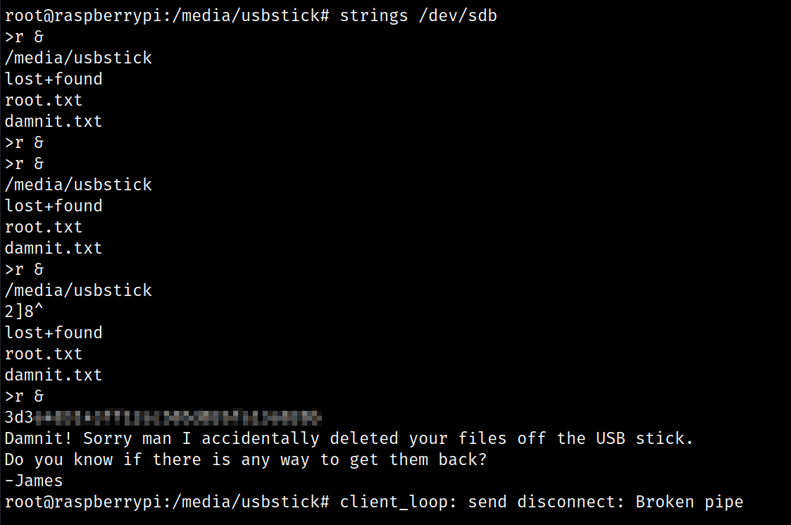

# Networked - Linux (Easy)

## Summary
Mirai was quite a fun box. It involved a RaspberryPi device with PiHole with the default username and password. While I was able to easily escalate privileges to become root, I needed to use `lsblk` to retrieve the deleted flag.

## Enumeration

I started Enumeration by running Rustscan on the the target.

```
rustscan -a $machine_IP -- -A -sV -sC -T4 -vv

-sC - Script Scan
-sV - Version Scan
-T4 - Timing Template
-A  - Aggresive Scan Options
-vv - Verbosity level

rustscan -a $machine_IP -- -A -sV -sC -T4 -v
.----. .-. .-. .----..---.  .----. .---.   .--.  .-. .-.
| {}  }| { } |{ {__ {_   _}{ {__  /  ___} / {} \ |  `| |
| .-. \| {_} |.-._} } | |  .-._} }\     }/  /\  \| |\  |
`-' `-'`-----'`----'  `-'  `----'  `---' `-'  `-'`-' `-'
The Modern Day Port Scanner.
________________________________________
: https://discord.gg/GFrQsGy           :
: https://github.com/RustScan/RustScan :
 --------------------------------------
Please contribute more quotes to our GitHub https://github.com/rustscan/rustscan

[~] The config file is expected to be at "/root/.rustscan.toml"
[!] File limit is lower than default batch size. Consider upping with --ulimit. May cause harm to sensitive servers
[!] Your file limit is very small, which negatively impacts RustScan's speed. Use the Docker image, or up the Ulimit with '--ulimit 5000'. 
Open $machine_IP:22
Open $machine_IP:53
Open $machine_IP:80
Open $machine_IP:1317
Open $machine_IP:32400
Open $machine_IP:32469

PORT      STATE SERVICE REASON         VERSION
22/tcp    open  ssh     syn-ack ttl 63 OpenSSH 6.7p1 Debian 5+deb8u3 (protocol 2.0)

53/tcp    open  domain  syn-ack ttl 63 dnsmasq 2.76
| dns-nsid: 
|_  bind.version: dnsmasq-2.76

80/tcp    open  http    syn-ack ttl 63 lighttpd 1.4.35
| http-methods: 
|_  Supported Methods: OPTIONS GET HEAD POST
|_http-title: Site doesn't have a title (text/html; charset=UTF-8).
|_http-server-header: lighttpd/1.4.35

1317/tcp  open  upnp    syn-ack ttl 63 Platinum UPnP 1.0.5.13 (UPnP/1.0 DLNADOC/1.50)

32400/tcp open  http    syn-ack ttl 63 Plex Media Server httpd
|_http-title: Unauthorized
|_http-favicon: Plex
| http-auth: 
| HTTP/1.1 401 Unauthorized\x0D
```

## Port 80 - HTTP

Navigating to the webpage returns an empty page. I then ran Gobuster to identify subdirectories 



It identified a JavaScript object as well as an admin landing page which I added to my `/etc/hosts` file. I was able to enumerate version numbers and attempt default creds of `pi:raspberry` which didn't work on the login page. The JavaScript object didn't result in much either. 



## Port 32400 - HTTP (Plex)

Despite default credentials not working in the webpage, I was able to sign up as a new user and access the underlying Plex Server.




## SSH > Raspberry Pi

I was able to use the default Raspberry Pi credentials of `pi:raspberry` to SSH into the box. Once I was in I found that the user could run anything as root. While I was able to read the `user.txt` file, I wasn't able to get a clear `root.txt` file.



```
root@raspberrypi:~# cat root.txt 
I lost my original root.txt! I think I may have a backup on my USB stick...
```

I then ran `lsblk` to view mounted folders. 



I can use the `strings` command to view the hidden content in this mount and subsequently read the `root.txt` file.



## Cert

