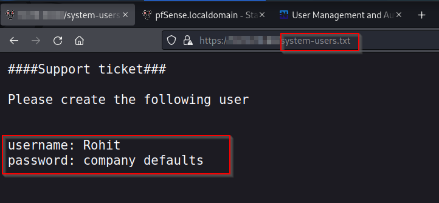
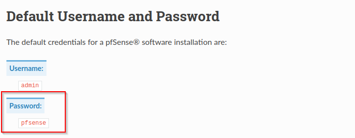
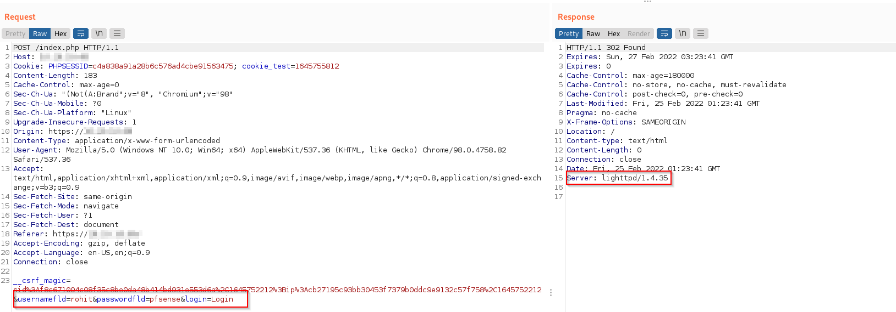
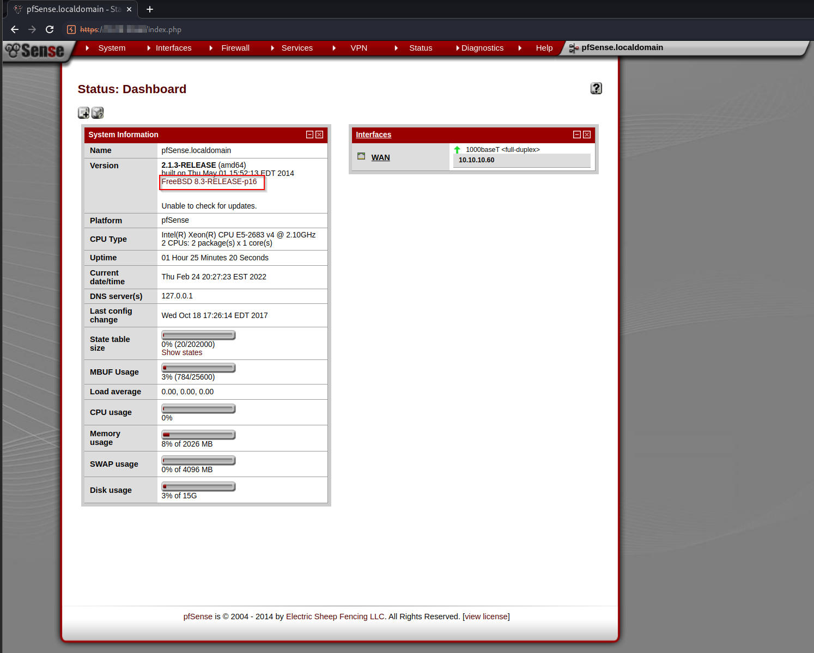
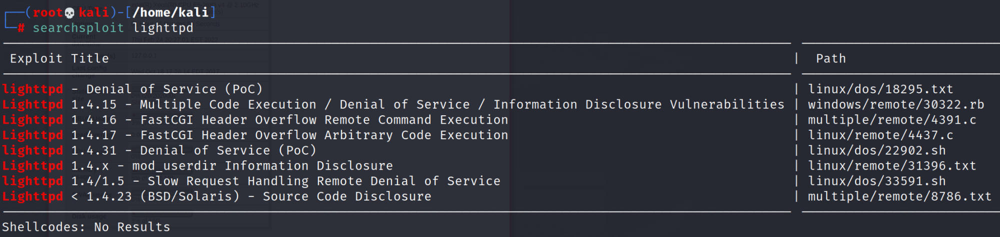
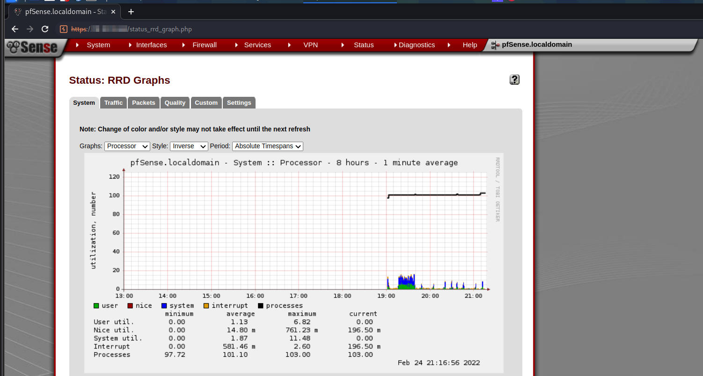
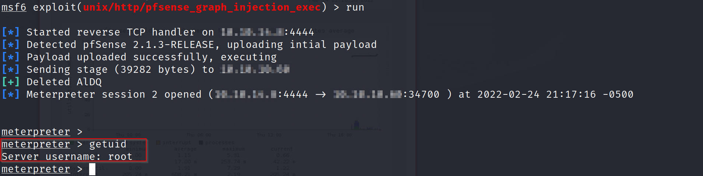
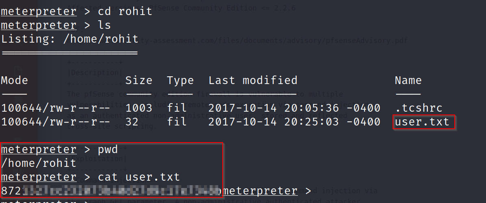
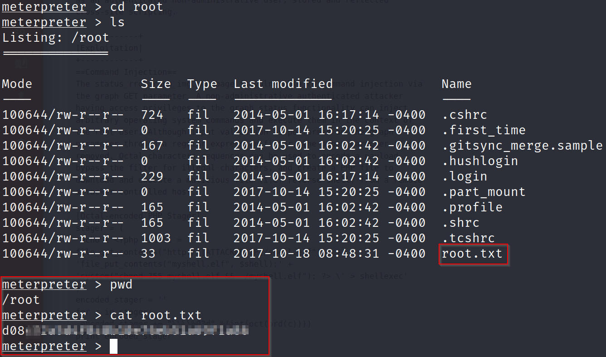
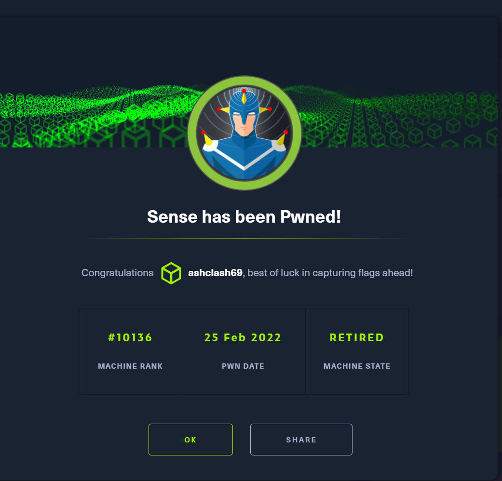

# Sense - Linux (Easy)

## Summary
Sense is one of the older boxes on HackTheBox. It's also a relatively easy box, focusing on using directory brute forcing to grab user credentials which provide access to a pfSense Firewall (hence the box name). This is one of the few times I have made the conscious decision to use Metasploit as I was not able to exploit the box using manual exploit vectors. Apart from this, it was nevertheless quite an enjoyable box and I got a lot out doing it.

## Enumeration

I began my Enumeration with a `Rustscan` scan of the target, picking up open ports which were then fed to `Nmap` for a more thorough scan

```
rustscan -a $machine_IP -- -A -sV -sC -T4 -v

-sC - Script Scan
-sV - Version Scan
-T4 - Timing Template
-A  - Aggresive Scan Options
-vv - Verbosity level

.----. .-. .-. .----..---.  .----. .---.   .--.  .-. .-.
| {}  }| { } |{ {__ {_   _}{ {__  /  ___} / {} \ |  `| |
| .-. \| {_} |.-._} } | |  .-._} }\     }/  /\  \| |\  |
`-' `-'`-----'`----'  `-'  `----'  `---' `-'  `-'`-' `-'
The Modern Day Port Scanner.
________________________________________
: https://discord.gg/GFrQsGy           :
: https://github.com/RustScan/RustScan :
 --------------------------------------
😵 https://admin.tryhackme.com

[~] The config file is expected to be at "/root/.rustscan.toml"
[!] File limit is lower than default batch size. Consider upping with --ulimit. May cause harm to sensitive servers
[!] Your file limit is very small, which negatively impacts RustScan's speed. Use the Docker image, or up the Ulimit with '--ulimit 5000'. 
Open $machine_IP:80
Open $machine_IP:443

PORT    STATE SERVICE    REASON         VERSION

80/tcp  open  http       syn-ack ttl 63 lighttpd 1.4.35

443/tcp open  ssl/https? syn-ack ttl 63

| Public Key type: rsa
| Public Key bits: 1024
| Signature Algorithm: sha256WithRSAEncryption
| Not valid before: 2017-10-14T19:21:35
| Not valid after:  2023-04-06T19:21:35
| MD5:   65f8 b00f 57d2 3468 2c52 0f44 8110 c622
| SHA-1: 4f7c 9a75 cb7f 70d3 8087 08cb 8c27 20dc 05f1 bb02
```

This resulted in two ports, 80 (HTTP) & 443 (HTTPS). Port 80 didn't result in much so I targeted port 443 instead. 

### Port 443

```
gobuster dir -u https://$machine_IP -w /usr/share/wordlists/dirbuster/directory-list-2.3-medium.txt -k -x php,html,txt
===============================================================

/index.html           (Status: 200) [Size: 329]
/index.php            (Status: 200) [Size: 6690]
/help.php             (Status: 200) [Size: 6689]
/themes               (Status: 301) [Size: 0] [--> https://$machine_IP/themes/]
/stats.php            (Status: 200) [Size: 6690]                               
/css                  (Status: 301) [Size: 0] [--> https://$machine_IP/css/]   
/edit.php             (Status: 200) [Size: 6689]                               
/includes             (Status: 301) [Size: 0] [--> https://$machine_IP/includes/]
/license.php          (Status: 200) [Size: 6692]                                 
/system.php           (Status: 200) [Size: 6691]                                 
/status.php           (Status: 200) [Size: 6691]                                 
/javascript           (Status: 301) [Size: 0] [--> https://$machine_IP/javascript/]
/changelog.txt        (Status: 200) [Size: 271]                                    
/classes              (Status: 301) [Size: 0] [--> https://$machine_IP/classes/]   
/exec.php             (Status: 200) [Size: 6689]                                   
/widgets              (Status: 301) [Size: 0] [--> https://$machine_IP/widgets/]   
/graph.php            (Status: 200) [Size: 6690]                                   
/tree                 (Status: 301) [Size: 0] [--> https://$machine_IP/tree/]      
/wizard.php           (Status: 200) [Size: 6691]                                   
/shortcuts            (Status: 301) [Size: 0] [--> https://$machine_IP/shortcuts/] 
/pkg.php              (Status: 200) [Size: 6688]                                   
/installer            (Status: 301) [Size: 0] [--> https://$machine_IP/installer/] 
/wizards              (Status: 301) [Size: 0] [--> https://$machine_IP0/wizards/]   
/xmlrpc.php           (Status: 200) [Size: 384]                                    
/reboot.php           (Status: 200) [Size: 6691]                                   
/interfaces.php       (Status: 200) [Size: 6695]                                   
/csrf                 (Status: 301) [Size: 0] [--> https://$machine_IP/csrf/]      
/system-users.txt     (Status: 200) [Size: 106]                                    
/filebrowser          (Status: 301) [Size: 0] [--> https://$machine_IP/filebrowser/]
/%7Echeckout%7E       (Status: 403) [Size: 345]
```

This resulted in quite a few interesting files. One that stood out was `system-users.txt` which showed a valid username with an apparent indication of a default password in use.



Since we know that the target is a pfSense router, I tried using default credentials which worked!



This ends up working and we are able to log in as the user `Rohit`





Manually traversing through the webpage was fairly empty except the `status` page which provided a version number that might be helpful with further enumeration if necessary. 

Since the `Nmap` scan and the `Burp Repeater` tabs indicated a lighthttpd server present. I looked it up on Searchsploit butt it didn't lead to much. 



I then searched for pfSense modules within Metasploit. 

```
msf6 > search pfsense

Matching Modules
================

   #  Name                                            Disclosure Date  Rank       Check  Description
   -  ----                                            ---------------  ----       -----  -----------
   0  exploit/unix/http/pfsense_clickjacking          2017-11-21       normal     No     Clickjacking Vulnerability In CSRF Error Page pfSense                                                                                                                                    
   1  exploit/unix/http/pfsense_graph_injection_exec  2016-04-18       excellent  No     pfSense authenticated graph status RCE
   2  exploit/unix/http/pfsense_group_member_exec     2017-11-06       excellent  Yes    pfSense authenticated group member RCE
```

Modules 2 & 3 are appropriate as we are currently authenticated and have access to pfSense. Going over the modules, module 2 seemed to be best suited as the Graph dashboard was something that I'd made a note of.



This worked like a charm and I was able to grab a root shell. 







## Cert

