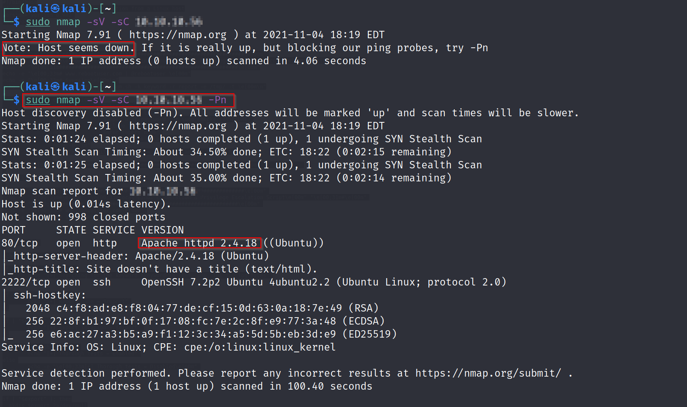
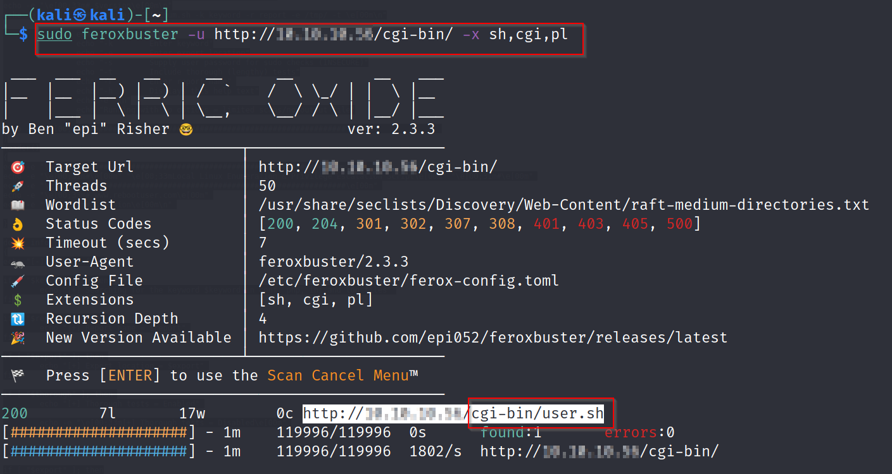
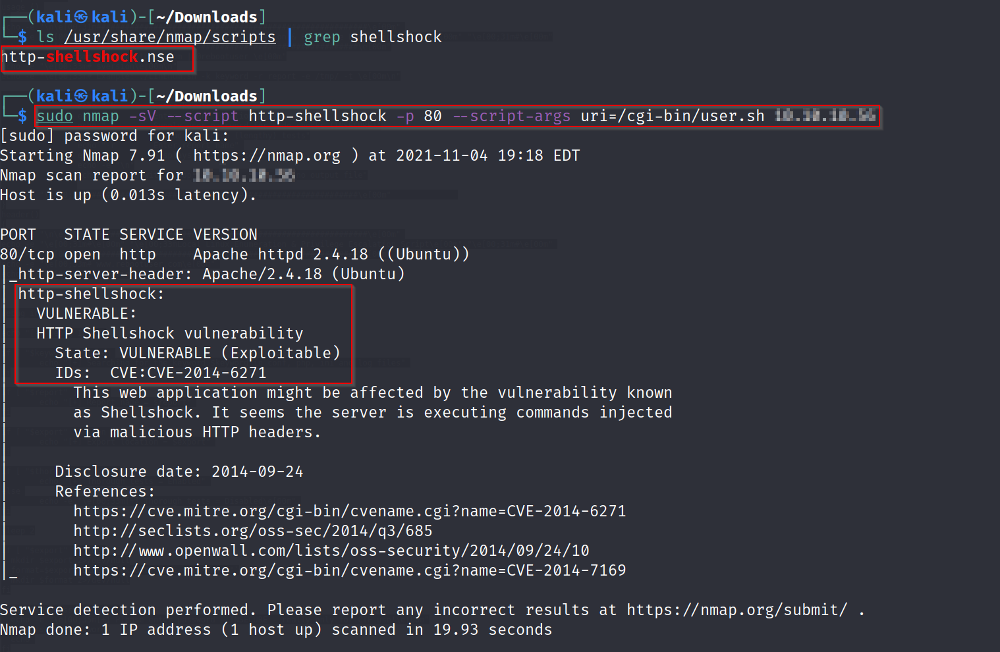
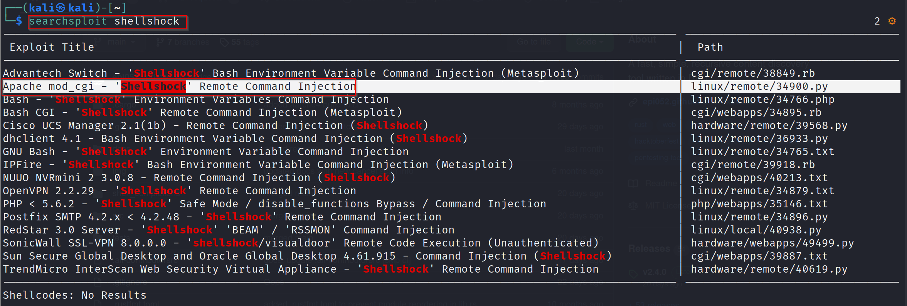
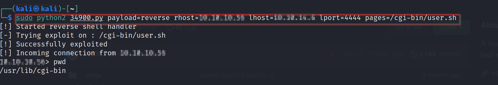
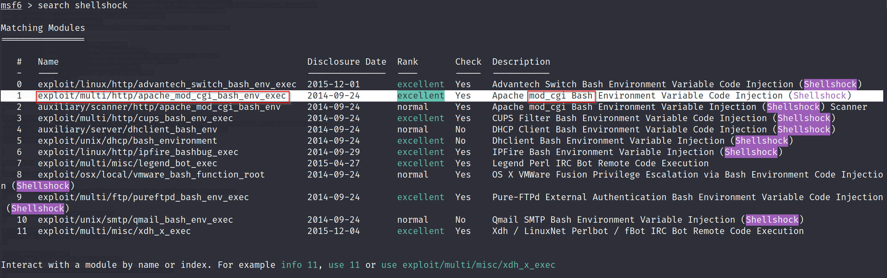

# Shocker - Linux (Easy)

## Summary

This box exploits the [Shellshock](https://en.wikipedia.org/wiki/Shellshock_(software_bug)) vulnerability, as evident in its name - a Bash vulnerability allowing attackers to execute commands with higher privileges. Shellshock, AKA CVE-2014-6271 is a Remote Command Execution attack vector affecting versions of Bash. It exploits the fact that Bash incorrectly executes trailing commands when importing a function definition in an Environment Variable. 

The below is a brief Proof of Concept (PoC) for Shellshock:

```
env x='() { :;}; echo vulnerable' bash -c "echo this is a test"
```

## Enumeration

I began Enumeration with an `Nmap` scan to find open ports and used the following command(s) to launch my scan.

```
sudo nmap -sV -sC $machine_IP

- This indicated that the host was not responding and I retried the scan with the -Pn flag

sudo nmap -sV -sC $machine_IP -Pn

-sV - Version Scan
-sC - Script Scan
-Pn - Disable host discovery & Only port scan
```



After identifying open ports and version numbers, I attempt to directory bruteforce. 

### Background
In this case, Gobuster and Feroxbuster misses anything of value due to a misconfiguration in the box. Normally, webservers redirect a missing trailing slash in a directory request by adding the trailing slash. However, with this box, such a request results in a `404 Not Found`.

**Solution** - Gobuster and Feroxbuster have a `-f` flag to force the trailing slash at the end of directories.


Following this, I drill down on the `/cgi-bin/` directory to look for files in that directory. 



Navigating to the `user.sh` file shows a script that Firefox is unable to render and prompts to download - It turns out to be an uptime test script which seems to indicate the presence of an CGI webserver, which according to my research was impacted by the Shellshock vulnerability. By now I had begun to make the connection between the box named *Shocker* and the *Shellshock* vulnerability. 

However, this was all still a hunch and to verify this, I ran a `Nmap` script on the machine to verify if it was indeed vulnerable to Shellshock.



## Getting a Shell

### Manual Exploitation

#### Searchsploit

I attempted to locate a Shellshock Remote Command Injection script on Searchsploit (command line copy of the popular [ExploitDB](https://www.exploit-db.com/searchsploit).




#### Exploitation and User Foothold

The `Python` script I was able to obtained had an example of command injection and I was able to tweak the script for this particular box with relevant parameters. 



This allowed be to obtain an initial user foothold and get the `user.txt` flag.


### Replicating with Metasploit

As always, after successfully manually exploiting a box, where applicable, I attempt to replicate my steps using Metasploit.

Since I already know that I'm after a Shellshock exploit for Apache CGI, I can filter my search criteria accordingly. 



After identifying the module I will be using, I set the relevant options


Once this is selected, I run the module and get a shell!


#### Privilege Escalation

I ran the `sudo -l` command to identify what can be run as the root user. This showed that the user could run `perl` as root. 

`Perl` has an `-e` flag which allows the running of `perl` scripts from the command line. This can be modified to allow me to get a shell as root. 


### Completion

