# Valentine - Linux (Easy)

## Summary

This box aims to demonstrate a successful exploitation of the [Heartbleed bug.](https://heartbleed.com/) Heartbleed allows an attacker to read the memory of systems running on the vulnerable versions of OpenSSL. This, in turn, compromises the secret keys used to encrypt the traffic and sensitive information. 

While doing my research on the Heartbleed exploit, I found the [xkcd](https://xkcd.com/1354/) explanation very helpful.


## Enumeration

As always we begin our Enumeration with a Nmap scan on the target

```
sudo nmap -sV -sC -A -T4 $machine_IP -vv

-sV Version Scan
-sC - Script Scan
-A - Aggresive Scan
-T4 - Aggresive Timing Template
-vv - very verbose
```
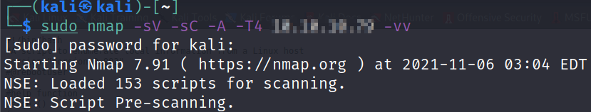

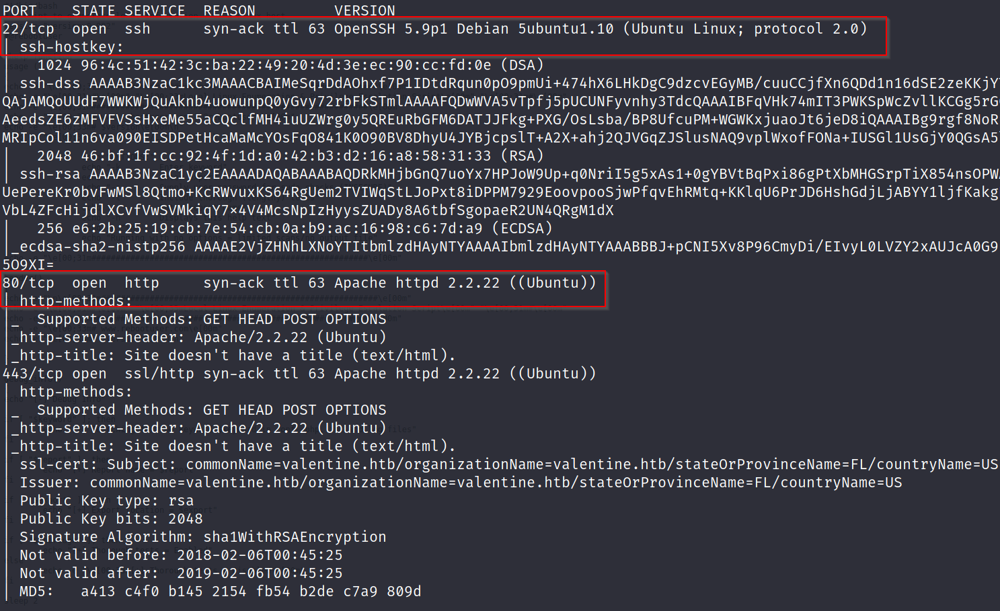

I also ran a Nmap NSE script to obtain more information on the target. The script identified that the target is vulnerable to SSL/TLS Man in The Middle attacks (MiTM), Heartbleed & Poodle

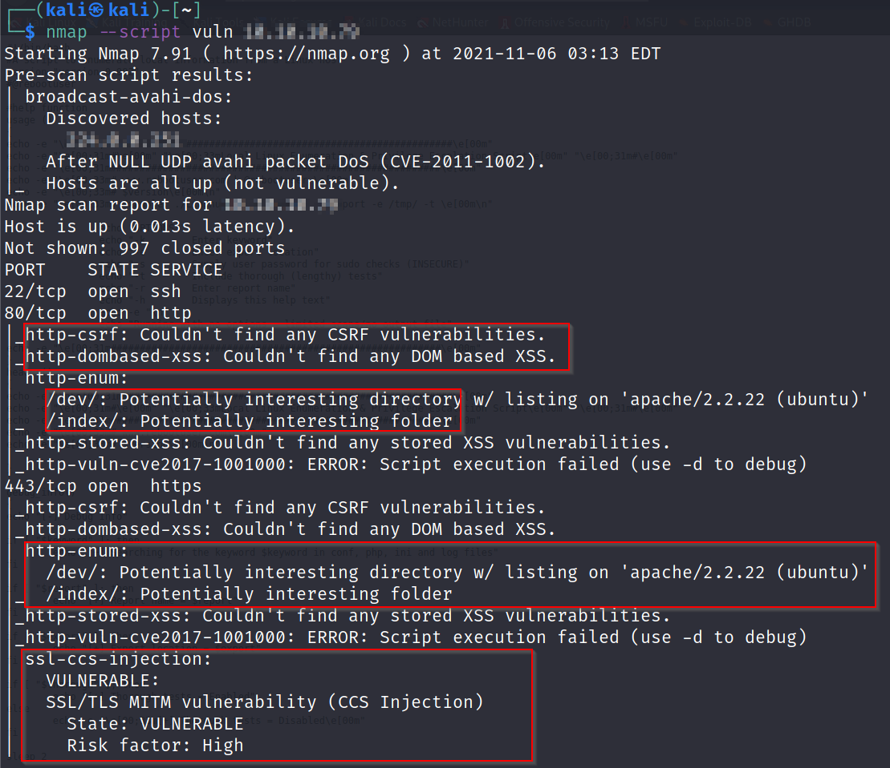


Following this result, in addition to the Heartbleed logo we are greeted with, when visiting the target IP, allows for a reasonable conclusion that the target is vulnerable to the Heartbleed exploit. 

As a final check, I ran SSLyze on the target with the following results, confirming that the target is indeed, vulnerable to Heartbleed.

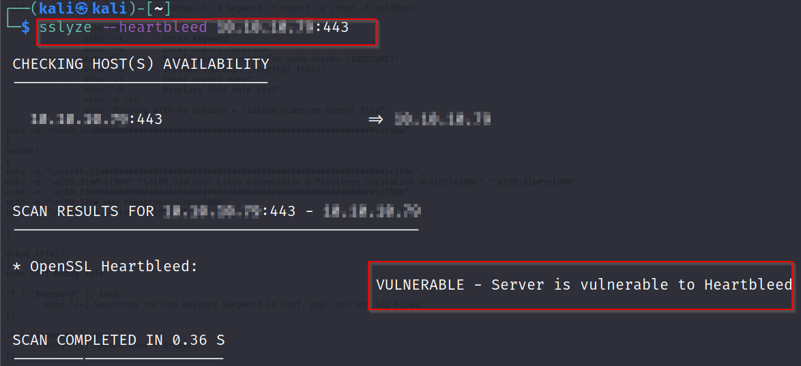

## Gobuster Recon

Enumerating Port 80, I ran Gobuster on the target, specifying certain extensions - `.php, .js, .html, .txt`

```
sudo gobuster dir -u "$machine_IP" -w "wordlist" -t50 -x php,js,html,txt

"-w" - specify wordlist
"-t 50" - 50 Threads
"-x" - flag to specify directory extensions
```

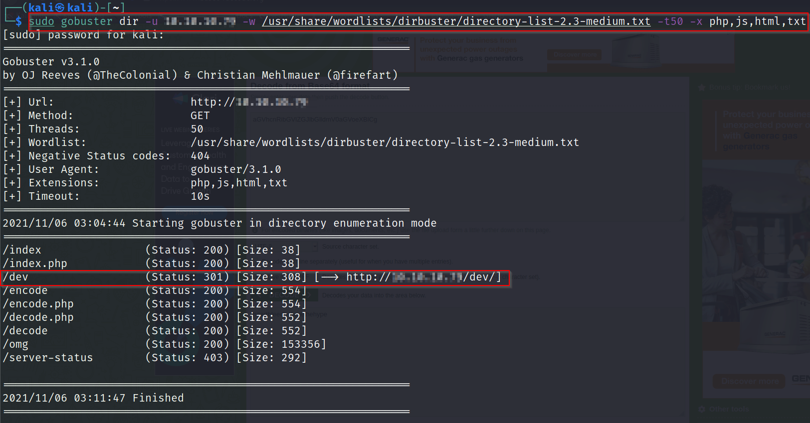

The `/dev` directory seemed promising and navigating to this directory showed two files - `notes.txt` & `hype.key`

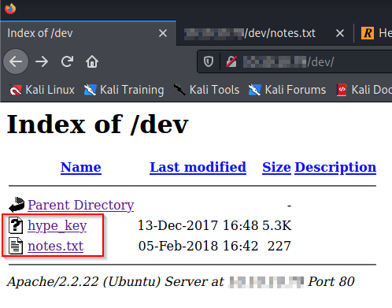

`notes.txt` had a few to-do items and suggests that the decoder is not fully up and running and might be vulnerable. 

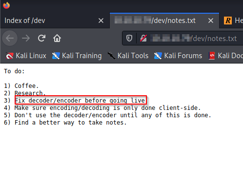

`hype_key` seems to be a bunch of hex bytes. I ran it through a Hex to ASCII Text Converter which decodes it to an encrypted RSA Private Key.

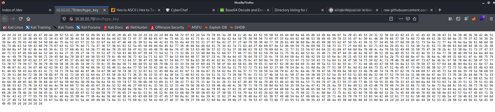

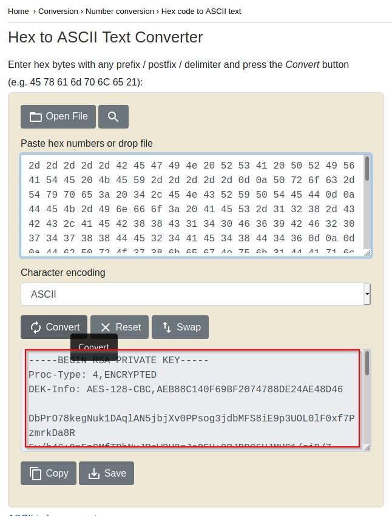

## Exploitation & User Foothold

I ran Travis Lee's Heartbleed [exploit](https://gist.github.com/eelsivart/10174134) to leak memory from the target which, in turn, returned base64 data that can be decoded to return a key that assists in further enumeration. 

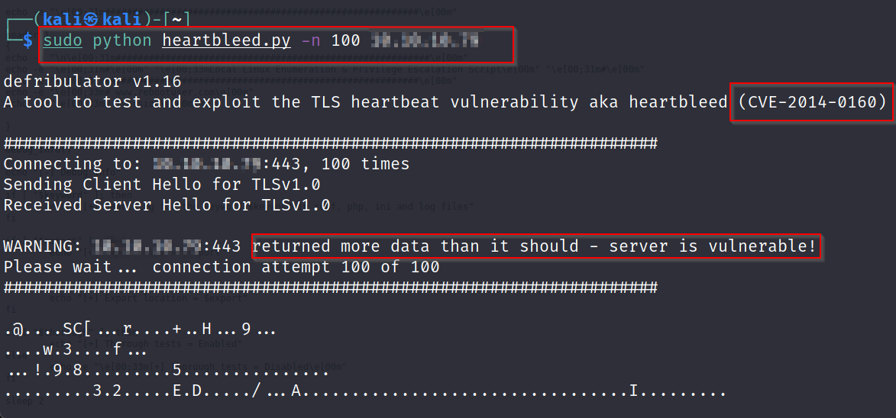

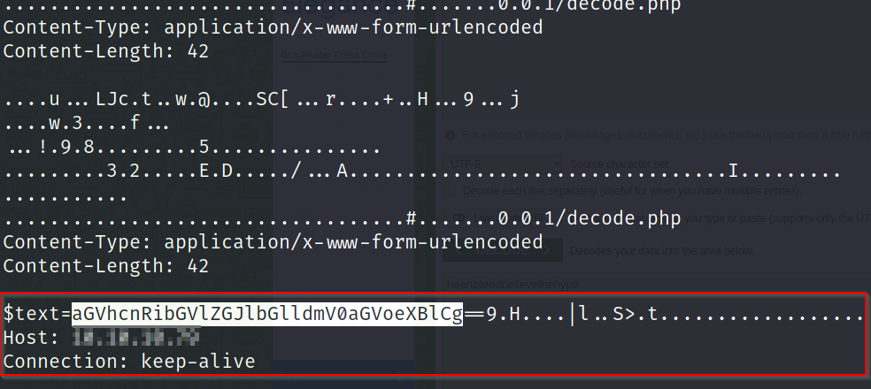

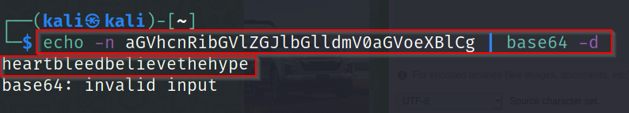

Having obtained the private key and the base64 decoded key, I was able to `ssh` in as the `hype` user and grab the `user.txt` flag

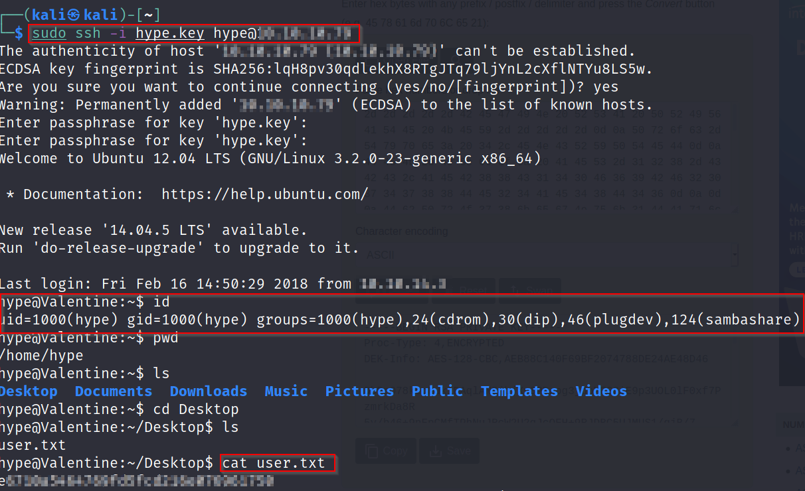

## Privilege Escalation

After gaining initial user access, I am able to escalate privileges and successfully root the box. Generally, after I root each box, I refer back to [IppSec's](https://www.youtube.com/channel/UCa6eh7gCkpPo5XXUDfygQQA) video on the box to compare methodologies and refine my process. After rooting this box, I noticed that IppSec also covered the Dirty Cow exploit in his [walkthrough](https://www.youtube.com/watch?v=XYXNvemgJUo), which I also will be demonstrating in this writeup. 

### Method 1: Exploiting tmux

After grabbing the user flag, I opened a `SimpleHTTPServer` to transfer `LinEnum.sh` from the attacker to the target. I use LinEnum to automate PrivEsc vector enumeration and in this case, found interesting options.

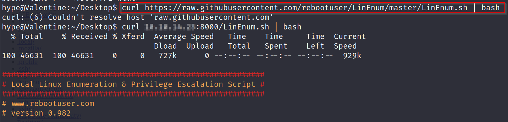

According to `LinEnum.sh`, tmux was running as root and I was able to manually confirm this

```
ps -ef | grep root

-ef - lists all processes on the system using standard syntax
```

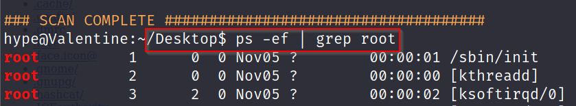

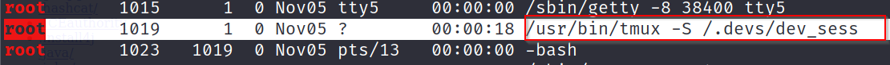

The output indicates that the `-S` flag is used with tmux to access the `/.devs/dev_sess` directory. The man page sheds some light on the usage of the `-S` flag

```
-S socket-path - Specify a full alternative path to the server socket.  If -S is specified, the default socket directory is not used and any -L flag is ignored.
```

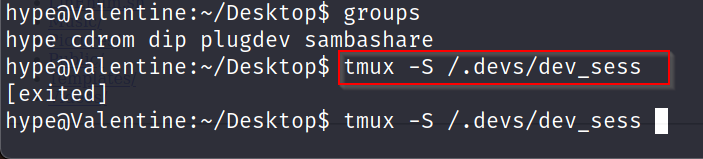

Running tmux with the `-S` flag results in a root shell and we are able to grab the root flag and pwn the target

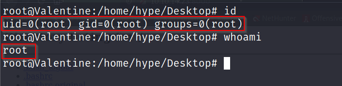

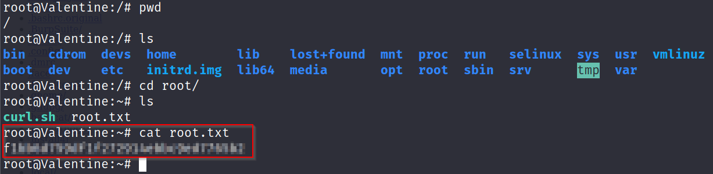

### Method 2: DirtyCow 

We are able to verify that this is an old kernel through the `uname` command

```
hype@Valentine:~$ uname -a
Linux Valentine 3.2.0-23-generic #36-Ubuntu SMP Tue Apr 10 20:39:51 UTC 2012 x86_64 x86_64 x86_64 GNU/Linux
```

Through Searchsploit, I was able to identify a working [exploit](https://www.exploit-db.com/exploits/40839), tweak it for the target and transfer it to the target.

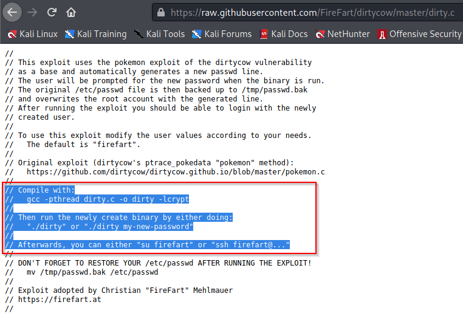

Upon compiling it with `gcc` I was able to successfully run the script, which creates the Firefart user with a blank password. Switching to the Firefart user with the blank password gives a root shell, which in turn, can be leveraged to grab the root flag. 

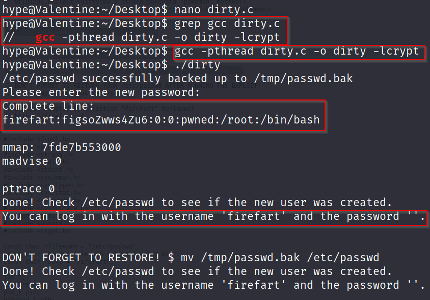

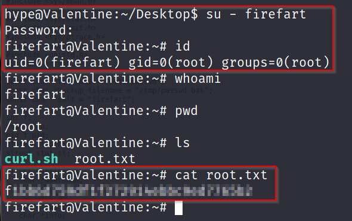

### Completion

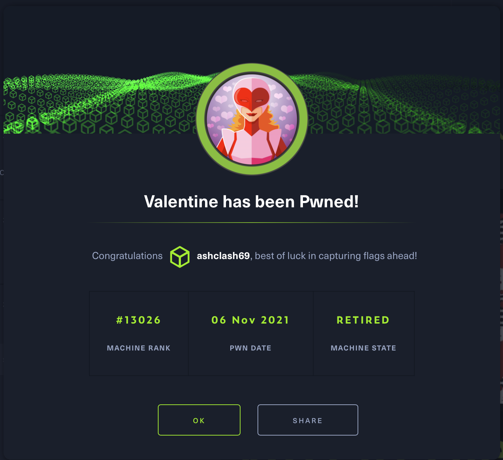